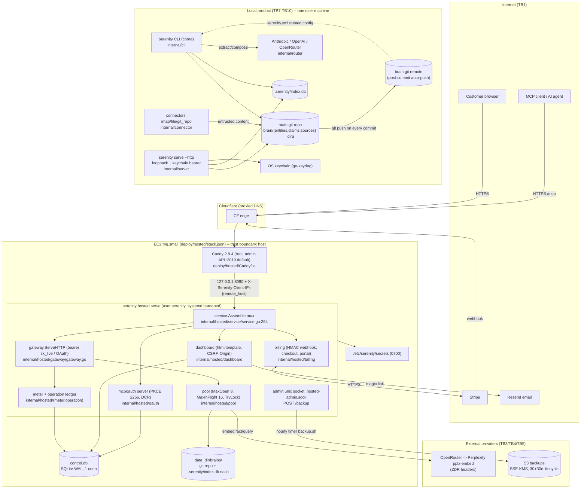

# Deep Review 001 -- Serenity (full codebase)

- Repository: sirerun/serenity (local checkout)
- Commit reviewed: 0f55bf0 (working tree), HEAD dated 2026-09-26 UTC
- Review date: 2026-09-27 UTC
- Scope: full codebase (local product + hosted product + deploy/CI + docs-chat + site)
- Mode: READ-ONLY. No production code was modified. Fixes are written into findings for a later /apply.
- Method: 11-phase audit. 5 discovery agents, 5 verification agents, 4 independent cross-validation agents (Phase 10). Every Critical/High re-traced from scratch by a fresh agent that did not read the prior reports.

## Executive Summary

Serenity is a well-engineered young codebase (first commit 2026-08-26) with strong
security fundamentals -- uniformly parameterized SQL, constant-time credential handling,
tenant-path validation, schema-bound and well-contained LLM output, and disciplined
hosted egress hygiene. Its risk today is not weak primitives but an incompletely wired
operational and recovery layer, a root-privileged web front door, and the general problem
that an LLM memory system ingests untrusted content and turns it into files, claims and
model prompts. There are no Critical findings. Five High findings were confirmed by
independent re-tracing; the hosted service runs as a single multi-tenant process, so most
High issues are availability or recovery failures that hit all tenants at once rather than
cross-tenant data disclosure (tenant isolation held up under scrutiny).

The three highest-risk findings in business terms: (1) **Caddy runs as root with its
unauthenticated admin API reachable on the host** (SEC-H01) -- any foothold on the box
becomes full root and a wiretap of every customer's traffic; (2) **the OAuth server can be
switched off for every customer by an unauthenticated attacker from about seventeen
addresses** (SEC-H02) -- within an hour every connected AI agent loses access, which for a
memory product is a total outage of the primary connection path; and (3) **restoring from
backup locks every customer out with no way back in** (FUN-04) -- the disaster-recovery
procedure, as written, cannot actually bring customers back online, so the product is not
yet safe to operate through an incident. A closely related pair (FUN-01/FUN-02) means that
today, ordinary hosted "remember" calls using the documented `30d` expiry silently fail and
burn the customer's paid quota with nothing stored.

The single most impactful architectural recommendation: **finish and wire the durable
operation-and-recovery layer that the design already specifies** (ADR 016/017). The
reservation reconciler, the pending-review resolver, the restore reactivation path and the
tombstone/deletion cascade are all written as contracts or dead code but never called, so
quota accounting drifts, recovery locks customers out, and "forget"/"delete" do not remove
data the customer was told is gone. Wiring this layer -- and dropping Caddy from root --
converts Serenity from "demoable" to "operable through failure", which is the stated wedge.

## Codebase Maturity Assessment

| Dimension | Level (1-5) | Evidence |
|-----------|-------------|----------|
| Security posture | 3 | Strong primitives (parameterized SQL; constant-time compares; per-call token re-verify with epochs, `oauth/hosted.go:39-55`; tenant path validation `pool.go:130-145`) offset by a root Caddy with an open admin API (SEC-H01) and unauthenticated availability holes (SEC-H02). |
| Code quality | 4 | Clean hexagonal layering, `errors.Join` at 54 sites, disciplined single-writer queue; a few god files (billing.go 1302 lines, ARC-M04) and 79 swallowed `_ =` sites (a handful material, FUN-05). |
| Test coverage | 3 | 274 test files, green across 75 packages; but no `dashboard_test.go`, no `gateway_test.go` for `callBound`, no lifecycle tests, and `router_test.go:211` injects a fake CostUSD that masks L-0008. |
| Architecture | 3 | Sound contract-anchored design, but the recovery/operation contract layer (ADR 016/017) is largely unwired dead code (ARC-H01), and there are two divergent brain-init paths (ARC-M02). |
| Observability | 2 | Telemetry package unwired; no access logs; CloudWatch alarms have no actions (INF-05); operators cannot see pending_review, pool failures, backup failures, or real spend (all zero via L-0008). |
| Error handling | 3 | `errors.Join` common and fail-closed parsing in extraction; but Scan errors swallowed in billing (FUN-05), a writer-panic process crash (CON-06), and truncated-export-returns-200 (FUN-07). |
| Dependency hygiene | 3 | `go mod verify` passes, `govulncheck` clean for called code; but an unreleased pseudo-versioned OAuth dependency (SUP-03) and no dependabot. |
| CI/CD maturity | 2 | 6 workflows, but no SHA-pinning, workflow-scope `contents: write` (SUP-02), floating goreleaser, no signing/SBOM/provenance, and no gitleaks/govulncheck/CodeQL (SUP-01). |
| AI/Agent security | 3 | Excellent containment (schema-bound extraction, citation whitelist, human-only precepts, no model output to exec/SQL) undercut by model-output-to-filesystem injection (SEC-H03), unimplemented redaction contract (AI-02), and a forgeable human-approval gate (AI-03). |
| Privacy/Compliance | 2 | "Forget"/"delete" are logical-only while docs promise erasure (PRIV-01); ~60-day backups vs 30-day disclosure (INF-04); unredacted local egress (PRIV-02). |

Overall maturity: **3.0 / 5** (weighted 2x on security and architecture, both 3). A capable
codebase at the "defined, partially implemented" stage; the gap to "managed" is wiring the
recovery layer, hardening the deploy, and closing the observability blind spots.

## Threat Model Summary

Two deployment shapes share one Go module (HEAD 0f55bf0, 2026-09-26 UTC): the **local
product** (`serenity` CLI + loopback `serve` daemon, brain = git repo, secrets in the OS
keychain, connectors ingest untrusted mail/files/repos, extraction and composition via
Anthropic/OpenAI/OpenRouter) and the **hosted product** (`serenity hosted serve` behind
Caddy on one EC2 host, magic-link identity, `sk_live` credentials + OAuth 2.1, Stripe
billing, one brain git repo per tenant, single-connection SQLite control DB, hourly S3
backups).

### Top 5 assets by sensitivity

| # | Asset | Where | Why it matters |
|---|-------|-------|----------------|
| A1 | Tenant / user memory (facts, sources, git history) | `data_dir/brains/<id>`, local `brain/` | Personal and business PII; the product's entire value |
| A5 | Precepts (`.dira` ledger, human-only) | `internal/direction`, `.dira/entries` | Constrain what agents may do; forgery = policy bypass |
| A3 | Provider and vendor secrets (embeddings, Resend, Stripe) | `/etc/serenity/secrets`, env, Secrets Manager | Spend, mail reputation, billing integrity |
| A2 | Sessions, `sk_live` credentials, OAuth tokens | `control.db` (hashed), browser cookie | Account takeover, cross-brain binding |
| A7 | Hosted availability (single process, 1 SQLite conn, 8-slot pool) | `internal/hosted/{gateway,pool,store}` | All tenants share one process; most High findings are availability |

### Top 5 attack surfaces by risk

1. **TB1 Internet -> Caddy -> hosted mux** (`/login`, `/oauth/*`, `/mcp`, `/billing/webhook`): unauthenticated reach, global rate-limit windows, Cloudflare-edge IP keying.
2. **TB8/TB10 Connector content -> extraction model -> filesystem/frontmatter** (`internal/extract` -> `internal/ingest` -> `internal/store/fence.go`): model output becomes file names and YAML.
3. **TB9 Brain git remote -> `serenity.yml` -> git subprocesses** (`internal/config`, `internal/cli/connectorbuild.go`, `internal/connector/gitrepo`): synced config is fully trusted; git runs without hardening.
4. **Host boundary: `serenity` user -> Caddy admin API (root)** (`deploy/hosted/caddy.service`, `Caddyfile`).
5. **TB2 MCP client -> gateway -> pool** (`internal/hosted/gateway/gateway.go`, `pool.go`): global locks, operation ledger, per-tenant work under shared mutexes.

### STRIDE findings mapped to discovered vulnerabilities

| Boundary | S | T | R | I | D | E |
|----------|---|---|---|---|---|---|
| TB1 hosted edge | Login CSRF via consume-on-GET (SEC-M01); invite-only oracle (SEC-L02) | -- | No access logs (INF-05) | Sliding session, no `__Host-` (SEC-L03) | OAuth global caps (SEC-H02); email bombing (SEC-M02); CF edge IP keying (SEC-M03); AccountCap (SEC-M04) | -- |
| TB2 MCP -> gateway | -- | Fingerprint ignores metadata (SEC-L05) | Facts carry no writer identity (AI-L03) | -- | g.mu / pool TryLock / poisoning (CON-01..03); ledger stranding (FUN-01); export pinning (CON-04) | Any write-scope client can forget any shared fact (AI-L03) |
| TB3 egress to embedder | -- | -- | -- | Unredacted egress, weak key regex (AI-02) | -- | -- |
| TB4 Stripe | HMAC + tolerance + dedupe (good) | Scan errors swallowed (FUN-05) | -- | -- | s.mu across Stripe paging (CON-05) | -- |
| TB6 admin socket | -- | -- | -- | -- | Backup FlushAll vs export (CON-04) | Arbitrary backup path (SEC-I01) |
| TB7 local daemon | Actor spoof on /disposition/dispose (AI-03) | -- | -- | Keychain readable by same user (SEC-L08) | synthesize unbounded (AI-04) | Precept self-accept (AI-03) |
| TB8 connectors | -- | gitrepo symlink follow (SEC-H04) | -- | auto-push of ingested bytes (SEC-H04) | one bad subject aborts batch (FUN-03) | -- |
| TB9 brain remote | -- | serenity.yml trusted (SEC-H05) | -- | -- | -- | fsmonitor exec (SEC-H05) |
| TB10 model output | -- | subject -> path/frontmatter (SEC-H03); planted claims (AI-01) | -- | markdown exfil (AI-05) | brain-wide parse failure (SEC-H03) | classifier fails open (AI-06) |
| Host | -- | Caddy admin API `/load` (SEC-H01) | -- | root file read via file_server (SEC-H01) | -- | root LPE (SEC-H01) |
| TB11 CI/release | -- | tag-pinned actions, floating goreleaser (SUP-01) | -- | contents:write on test job (SUP-02) | -- | -- |

### LINDDUN (personal data is handled)

- **Linkability**: `email_hash` + `stripe_customer_id` + `audit_log` per action (`internal/hosted/store/migrations.go`).
- **Identifiability**: absolute local paths in source URIs are pushed to the brain remote (local product).
- **Detectability**: invite-only enumeration (SEC-L02); readiness endpoint discloses dependency health.
- **Disclosure**: `forget` keeps canonical bytes, FTS/vector rows, export bundle carries full history, S3 keeps ~60 days (PRIV-01); every fact and query leaves to the embedding provider unredacted (AI-02).
- **Unawareness**: local post-commit auto-push of ingested email/repo bytes (SEC-H04); hosted embedding egress is disclosed on the dashboard (good).
- **Non-compliance**: deletion chain (`TombstoneCascade`, `DeletionJournal`) is unimplemented while `docs/threat-model.md:183-210` describes it (PRIV-01).

### Attack trees for the highest-risk scenarios

```
GOAL: root on the hosted VM (SEC-H01)
  AND: code execution as user `serenity` (any of)
       |- writer.Queue panic? (no: crash, not exec)  -> not a path
       |- future app RCE / supply-chain (SUP-01, mcpoauth unreleased)
       |- operator shell as serenity
  AND: POST http://127.0.0.1:2019/load  (Caddyfile has no admin block; unit has no User=)
  -> file_server root "/" served as root; TLS keys + ACME account read; upstream re-pointed (MITM of every tenant)

GOAL: deny every OAuth-connected agent for all tenants (SEC-H02)
  OR: 2000 req/min to any /oauth path from >=17 IPs (or IPv6 /64 rotation)
  OR: 10,000 live oauth_consents via GET /oauth/authorize in ~5 min
  -> refresh at /oauth/token 429 after <=1h; new connections impossible

GOAL: persistent brain-wide outage of one user's memory (SEC-H03)
  1. email/file/repo text instructs the extractor to emit subject "x\ntype: precept"
  2. filterCandidates keeps it (extract.go:559-580) -> safePart allows \n (batch.go:109)
  3. RenderEntity writes "slug: x\ntype: precept" (fence.go:109) -> committed
  4. yaml.v3 duplicate key -> Rebuild, AllClaims, entity, extraction all fail each sync

GOAL: exfiltrate a developer's private files (SEC-H04 + SEC-H05)
  OR: victim crawls attacker repo with tracked symlink -> os.ReadFile follows it -> brain commit -> auto-push
  OR: attacker writes to a shared brain remote: serenity.yml points git_repo at a nested repo blob with core.fsmonitor -> git ls-files --others executes it
```

### MITRE ATT&CK mapping for Critical/High findings

| Finding | Techniques |
|---------|-----------|
| SEC-H01 Caddy root + admin API | T1068 Exploitation for Privilege Escalation; T1552.001 Credentials in Files; T1557 Adversary-in-the-Middle |
| SEC-H02 OAuth global caps | T1499.002 Endpoint DoS: Service Exhaustion Flood; T1498 Network DoS |
| SEC-H03 Extraction subject injection | T1565.001 Stored Data Manipulation; T1499.004 Application Exhaustion; T1204 User Execution (indirect prompt) |
| SEC-H04 gitrepo symlink + auto-push | T1005 Data from Local System; T1552.004 Private Keys; T1567 Exfiltration over Web Service |
| SEC-H05 serenity.yml + fsmonitor | T1059.004 Unix Shell; T1195.002 Supply Chain Compromise: Software; T1546 Event Triggered Execution |

## System Architecture Map



## Critical and High Findings

No Critical findings. Five High findings, all VERIFIED by an independent fresh-eyes
re-trace (Phase 10). Finding IDs are stable and cross-referenced throughout.

---

### SEC-H01 [VERIFIED] [High] Caddy runs as root with its unauthenticated admin API on localhost:2019

- CWE: CWE-250 (Execution with Unnecessary Privileges); CWE-306 (Missing Authentication for Critical Function)
- CVSS: CVSS:3.1/AV:L/AC:L/PR:L/UI:N/S:U/C:H/I:H/A:H -- 7.8 (High)
- Age: RECENT -- caddy.service introduced 2026-09-22 by 28b1ddd; Caddyfile header_up 2026-09-18 by e90bf5e
- Location: deploy/hosted/caddy.service:6-11; deploy/hosted/Caddyfile:1-12; deploy/hosted/bootstrap.sh:1-68; deploy/hosted/serenity-hosted.service:7-23
- Description: The Caddy systemd unit sets no User=/Group=/DynamicUser= and no sandboxing, so Caddy 2.8.4 runs as root. The Caddyfile has no global options block, so `admin off` is never set and Caddy's default admin endpoint listens on TCP localhost:2019 with no authentication (its only guard is a Host/Origin allowlist against DNS rebinding). No host firewall restricts loopback, and serenity-hosted.service has no IPAddressDeny. Any local process (the `serenity` service user, or any local account) can POST a new configuration to the admin API, which Caddy applies as root.
- Attack narrative: Given code execution as `serenity` (a future app RCE, a compromised dependency, or an operator shell), the attacker submits a config to the loopback admin API that adds a static file server rooted at `/`, or redirects the site's upstream to an attacker host. Caddy applies it as root, exposing root-owned files (TLS private keys and the ACME account under /root/.local/share/caddy) and enabling a full man-in-the-middle of every tenant's traffic after TLS termination. The app's own systemd hardening is bypassed because Caddy, not the app, holds root.
- Blast radius: the entire host, every tenant's traffic and credentials, and the TLS identity of the service hostname.
- Verification evidence: (1) infra discovery flagged the missing User= and missing admin directive; (2) traced caddy.service:6-11 (no User) -> Caddyfile:1-12 (no global admin block, so Caddy default localhost:2019) -> bootstrap.sh (no firewall) -> serenity-hosted.service:7-23 (no IPAddressDeny) -> deploy.sh:95 `systemctl reload caddy` + caddy.service:9 ExecReload prove the admin API is live and load-bearing; (3) Phase 10 re-read all files, searched internal/ for any network-reachable SSRF to 127.0.0.1:2019 (none: outbound HTTP targets fixed hosts only), and kept AV:L / 7.8; (4) not a false positive: Caddy enables the admin endpoint by default whenever no `admin` directive is present, and the reload path depends on it.
- Fix (config, defensive): move the admin API to a root-only unix socket and drop privileges.
```
# deploy/hosted/Caddyfile (top of file)
{
    admin unix//run/caddy/admin.sock|0600
}
```
```
# deploy/hosted/caddy.service [Service]
User=caddy
Group=caddy
AmbientCapabilities=CAP_NET_BIND_SERVICE
CapabilityBoundingSet=CAP_NET_BIND_SERVICE
NoNewPrivileges=yes
ProtectSystem=strict
ProtectHome=yes
PrivateTmp=yes
RuntimeDirectory=caddy
StateDirectory=caddy
Environment=XDG_DATA_HOME=/var/lib/caddy XDG_CONFIG_HOME=/var/lib/caddy/config
ExecReload=/usr/local/bin/caddy reload --config /etc/caddy/Caddyfile --address unix//run/caddy/admin.sock
```
- Fix safety: `admin off` alone breaks deploy.sh:95 (`systemctl reload caddy` uses the admin API); the unix-socket form keeps reloads working via the matching --address. Changing User moves storage from /root/.local/share/caddy to /var/lib/caddy; copy and chown it first or Caddy re-issues certificates (rate limits, brief TLS gap). Confirm the ACME challenge path behind Cloudflare before any security-group change. Verify: `ss -ltnp | grep 2019` empty; `sudo -u serenity curl -s localhost:2019/config/` refused.
- Attack chain potential: HIGH. Escalates any app compromise to root; combines with INF-03 (no IMDS deny) to reach Stripe secrets and every tenant's decrypted backups (Attack Chain AC-1).
- ATT&CK mapping: T1068, T1552.001, T1557

---

### SEC-H02 [VERIFIED] [High] Unauthenticated denial of the OAuth authorization server for every tenant via global fixed-window limits and table caps

- CWE: CWE-770 (Allocation of Resources Without Limits or Throttling); CWE-400
- CVSS: CVSS:3.1/AV:N/AC:L/PR:N/UI:N/S:U/C:N/I:N/A:H -- 7.5 (High)
- Age: RECENT -- introduced 2026-09-24 by 292904b
- Location: internal/hosted/oauth/hosted.go:72-77; internal/hosted/oauth/ratelimit.go:42-60; internal/hosted/oauth/store.go:36-53; internal/hosted/service/service.go:272-273
- Description: Every /oauth/* request passes a limiter with a shared global window (2000/min overall, 1000/min token, 100/min register). In ratelimit.go:42-48 the global window is checked BEFORE the per-IP window, so once 2000 requests from anyone land in a minute every caller (including legitimate refresh_token grants) is refused until the window resets. With the per-IP cap of 120/min, about 17 source addresses saturate it; limiters key on the full IP string, so a single IPv6 /64 supplies unlimited keys. Separately, store.go:36-53 caps each OAuth table at 10,000 rows; oauth_consents rows are created per authorize (20-minute TTL) and cannot be evicted early. Access tokens live one hour (mcpoauth default, not overridden).
- Attack narrative: an unauthenticated attacker sends counted requests to any /oauth path from ~17 addresses (directly to the origin, which the security group exposes on 443 to 0.0.0.0/0, or through Cloudflare). The global window fills within seconds each minute, so every authorize/consent/register/token call returns 429. Sustained beyond one hour, every OAuth-connected MCP client fails its refresh and loses access; new connections are impossible. A variant fills oauth_consents to 10,000 live rows in a few minutes, blocking all new authorizations for up to 20 minutes after the attack stops. Manual sk_live bearers on /mcp are unaffected (service.go:272-273).
- Blast radius: all tenants using OAuth (the canonical Claude connection path); no data exposure.
- Verification evidence: (1) discovery of the limiter constructors and table caps; (2) traced hosted.go:77 (wraps whole /oauth mux) -> ratelimit.go:42-48 (global precedes per-IP) -> :55-60 (per-IP 120) -> :74-87 (keys on full address) -> store.go:36-53 (10k refusal) -> mcpoauth 1h tokens; (3) Phase 10 re-traced from code, computed the same 17-IP threshold and ~5-minute consent fill, confirmed /mcp is outside the limiter, verdict VERIFIED High 7.5; (4) not a false positive: the global counter is unconditional and precedes authentication; nothing exempts refresh grants.
- Fix (defensive): check a per-key token bucket first (per /24 v4, /56 v6), apply the global ceiling only to unauthenticated state-creating paths and raise it, exempt refresh_token grants for known grants, and cap live consents per client_id rather than per table.
```go
func prefixKey(ip net.IP) string {
    if v4 := ip.To4(); v4 != nil {
        return v4.Mask(net.CIDRMask(24, 32)).String()
    }
    return ip.Mask(net.CIDRMask(56, 128)).String()
}
```
- Fix safety: oauth/ratelimit.go has no unit test; TestOAuthBrowserConsentMCPAndRevocation (internal/hosted/service/oauth_test.go:24) exercises the endpoints and must stay green. Add a table test for the 17-IP scenario and the consent cap.
- Attack chain potential: MEDIUM. Combines with SEC-M03 (Cloudflare edge keying) and SEC-M02 (email bombing) to deny both login and OAuth.
- ATT&CK mapping: T1499.002, T1498

---

### SEC-H03 [VERIFIED] [High] Model-controlled subject becomes a file name and raw YAML frontmatter: persistent brain-wide retrieval outage and entity alias hijack

- CWE: CWE-20 (Improper Input Validation); CWE-93 (CRLF/newline injection); CWE-116 (Improper Encoding of Output)
- CVSS: CVSS:3.1/AV:N/AC:L/PR:N/UI:R/S:U/C:N/I:L/A:H -- 7.1 (High)
- Age: ESTABLISHED -- store/fence.go:109 introduced 2026-08-26 by 13dc0d2; extract.go:461 2026-08-28 by 9552300; ingest/batch.go safePart 2026-09-08 by f77827e
- Location: internal/extract/extract.go:559-580, :461; internal/ingest/batch.go:52-55, 109-111; internal/store/fence.go:109, :216-242; internal/writer/publish.go:109-137; internal/index/rebuild.go:58-61; internal/compose/compose.go:387-390; internal/server/memory/entity.go:187-189, 209-214
- Description: The extraction model's `subject` string is used verbatim as the entity slug. filterCandidates only TrimSpaces it (the newline check applies to `object`), safePart rejects only `"" . .. / \ NUL * ? [ ]`, publicationPath rejects only absolute/unclean/backslash segments, and RenderEntity writes the slug into YAML frontmatter with no escaping. A subject containing a newline is therefore committed as a directory and file name and injects arbitrary YAML keys into the page header. Because the parser uses yaml.v3, a duplicate `type:` key makes the page unparsable, and every consumer aborts on the first parse error: index.Rebuild, compose.AllClaims (ask, MCP synthesize), the MCP entity tool, and extraction for that subject. sync re-extracts sources each run, so the state never self-heals. The variant subject with an injected `aliases:` line parses cleanly and gives the attacker's page alias priority in entity resolution.
- Attack narrative (reproduced by two independent agents on scratch copies): attacker-controlled content (an ingested email or a crawled file) instructs the extractor to emit a subject whose value contains a newline followed by a YAML key. filterCandidates accepts it; safePart passes; RenderEntity writes it into the page header; commit succeeds because staging uses NUL literal pathspecs. On the next parse the page fails with a yaml duplicate-key error, and Rebuild / AllClaims / entity / extraction all fail on every sync until someone finds and deletes a file with a newline in its name. The alias variant makes a lookup for a real person's name resolve to the attacker's page.
- Blast radius: one user's or one tenant's entire brain -- all retrieval, composition and extraction for that brain.
- Verification evidence: (1) lead's read of fence.go:109 and batch.go:109-111; (2) traced model JSON -> extract.go:461 raw SubjectSlug -> :559-580 TrimSpace only -> batch.go:109-111 (no control-char check) -> publish.go:109-137 (no control-char check) -> fence.go:109 raw write -> commit.go:127-128 NUL pathspecs -> fence.go:227 yaml duplicate-key error -> rebuild.go:58-61 / compose.go:387-390 / entity.go:187-189; (3) the Phase 4 verifier and the Phase 10 agent each reproduced the newline commit and the resulting Rebuild/AllClaims failure on scratch copies, and Phase 10 reproduced the alias hijack, rating 7.1; (4) not a false positive: there is no validation between the model boundary (extract.go:461) and the sink (fence.go:109) that rejects newline or colon, and the parser is strict where the writer is not.
- Fix (defensive): add a strict slug validator used at the model boundary and re-checked at the writer; drop bad candidates instead of failing the batch; emit frontmatter via yaml.Marshal; refuse (never escape) an invalid slug/type in RenderEntity; reject control characters in publicationPath; and quarantine a single unparsable page in Rebuild/AllClaims instead of failing the whole brain.
```go
// internal/domain/slug.go (new)
var slugRE = regexp.MustCompile(`^[a-z0-9](?:[a-z0-9-]{0,62}[a-z0-9])?$`)
func ValidSlug(s string) bool { return slugRE.MatchString(s) }
// filterCandidates: if !domain.ValidSlug(subject) || strings.IndexFunc(object, unicode.IsControl) >= 0 { rejected++; continue }
// safePart: return domain.ValidSlug(v)
// RenderEntity: if !domain.ValidSlug(slug) || !domain.ValidSlug(typ) { return nil, fmt.Errorf(...) }
```
- Fix safety: touches extract_test.go, ingest/batch_test.go, store/fence_test.go and writer/fence_test.go. Existing slugs are lowercase-hyphen in practice; add a migration check that lists non-conforming existing pages before enforcing on read.
- Attack chain potential: HIGH. Same delivery vehicle as AI-01 (planted claims) and AI-05 (markdown exfil); the alias variant enables identity confusion for later prompts.
- ATT&CK mapping: T1565.001, T1499.004, T1204

---

### SEC-H04 [VERIFIED] [High] git_repo connector follows tracked symlinks outside the repository; bytes are committed to the brain and auto-pushed to the remote

- CWE: CWE-59 (Improper Link Resolution Before File Access); CWE-200
- CVSS: CVSS:3.1/AV:N/AC:H/PR:N/UI:R/S:C/C:H/I:N/A:N -- 6.8 (rated High by reviewer consensus: exfiltration is automatic and silent)
- Age: ESTABLISHED -- gitrepo.go:156 introduced 2026-08-28 by 429197d; post-commit push hook internal/cli/gitx.go 2026-08-26 by 13dc0d2
- Location: internal/connector/gitrepo/gitrepo.go:156, :350, :365-374; internal/cli/gitx.go:20-61; internal/writer/commit.go
- Description: Poll lists tracked and untracked files and then reads each with os.ReadFile(filepath.Join(toplevel, rel)). os.ReadFile follows symlinks; there is no Lstat, no regular-file check, and no containment check that the resolved path stays under the repository top level. A repository that tracks a symlink pointing outside the repo (for example to a user's SSH or cloud-credential file) causes the victim's sync to read those bytes, write them under brain/sources/ (not gitignored), commit them, and push them to the brain remote via the post-commit hook installed at init. The bytes are also sent to the extraction model. index_only cannot help because no caller ever sets it on the router.
- Attack narrative: the victim adds an attacker-supplied repository as a git_repo connector and runs sync. The connector lists the tracked symlink, os.ReadFile follows it out of the repository, and the linked file's contents are stored as a source, committed, pushed to the configured remote, and sent to the model provider -- all without the victim's awareness.
- Blast radius: any file readable by the victim user; the leak is persistent in the brain remote's history and disclosed to the model provider.
- Verification evidence: (1) lead's read of gitrepo.go:156; (2) traced :350 listing -> :156 symlink-following read -> source write under brain/sources -> writer.Flush commit -> gitx.go:20-61 post-commit push; :365-374 exec passes no -c overrides and inherits the environment; (3) the Phase 5 verifier and the Phase 10 agent confirmed from code (not reproduced) and rated High conditional on crawling an untrusted repo; (4) not a false positive: os.ReadFile documented behaviour, no Lstat/EvalSymlinks anywhere in the connector, and the push hook is installed unconditionally by serenity init.
- Fix (defensive): Lstat each path, skip non-regular files, resolve symlinks and confirm the result stays under the repository root, then read.
```go
func readContained(toplevel, rel string) ([]byte, error) {
    p := filepath.Join(toplevel, rel)
    fi, err := os.Lstat(p)
    if err != nil { return nil, err }
    if !fi.Mode().IsRegular() { return nil, fmt.Errorf("gitrepo: skip non-regular %q", rel) }
    real, err := filepath.EvalSymlinks(p)
    if err != nil { return nil, err }
    root, _ := filepath.EvalSymlinks(toplevel)
    if !strings.HasPrefix(real, root+string(filepath.Separator)) {
        return nil, fmt.Errorf("gitrepo: path escapes repository %q", rel)
    }
    return os.ReadFile(real)
}
```
- Fix safety: touches gitrepo_test.go only; add a tracked-symlink fixture. No behaviour change for regular files.
- Attack chain potential: HIGH. Shares its exec site with SEC-H05 and its egress with AI-02 (unredacted provider egress).
- ATT&CK mapping: T1005, T1552.004, T1567

---

### SEC-H05 [VERIFIED] [High] Brain-synced serenity.yml is fully trusted and git subprocesses run unhardened

- CWE: CWE-94 (Improper Control of Generation of Code); CWE-829 (Inclusion of Functionality from Untrusted Control Sphere); CWE-15 (External Control of Configuration Setting)
- CVSS: CVSS:3.1/AV:L/AC:H/PR:N/UI:N/S:C/C:H/I:H/A:H -- 7.5 (High; AV:N/8.6 if the brain remote is treated as a channel the user does not control)
- Age: ESTABLISHED -- config.go:151 introduced 2026-08-27 by 13dc0d2; connectorbuild.go:72 2026-08-28 by b9c4c01; serve.go:158 2026-09-12 by 5b039f3
- Location: internal/config/config.go:96, 151-162; internal/cli/connectorbuild.go:72-86; internal/cli/serve.go:158-163; internal/connector/gitrepo/gitrepo.go:350, 365-374; internal/writer/commit.go:150-159; internal/writer/plan.go:200; internal/writer/dirtytree.go:49; internal/direction/publication.go:211, 322; internal/supersede/publication.go:277
- Description: serenity.yml is committed at init and synced across machines through the brain remote, yet it is treated as fully trusted configuration. config.Load uses yaml.Unmarshal with no KnownFields (unknown keys silently accepted), Connectors is an untyped map, connectorbuild.go:72-86 passes a connector's `path` verbatim as the git repository root with no absolute/clean/containment check, and loadServerConfig returns the server bind address unchecked. Independently, every git invocation in the codebase runs with cmd.Dir set to a repository directory but passes no configuration-hardening overrides and does not scrub the inherited environment. This exposes the well-known git "fsmonitor" code-execution class: git runs a repository-configured hook/monitor program on index-refreshing subcommands. A fresh-eyes agent confirmed with GIT_TRACE that the connector's file-listing subcommand and the writer's status/diff subcommands trigger this class, while rev-parse/log/show do not (git 2.54.0). Because config trust and the missing overrides combine, a hostile configuration and repository state delivered through a shared or compromised brain remote can cause command execution on any machine that syncs that brain. (See public git advisories in the CVE-2022-24765 fsmonitor family for the mechanism.)
- Attack narrative (mechanism only; no payload reproduced here): an attacker who can write to a shared brain remote publishes a serenity.yml that points a git_repo connector at attacker-controlled repository state whose configuration enables the fsmonitor program. When any collaborator's machine syncs the brain and runs a normal sync, git refreshes the index using the connector's listing subcommand and executes the configured program under the collaborator's account. The trust root is that synced configuration and repository state are treated as first-party.
- Blast radius: command execution on every machine that syncs a shared or compromised brain; escalates via the local product's file access and the post-commit auto-push.
- Verification evidence: (1) lead's read of config.Load and connectorbuild.go; (2) traced config.go:151-162 (no KnownFields) -> connectorbuild.go:72-86 (path unvalidated) -> gitrepo.go:365-374 (exec with no -c overrides, no env scrub) and the inventory of every other git call site; (3) the Phase 10 agent reproduced the fsmonitor-execution class on throwaway repos with GIT_TRACE, confirmed which subcommands refresh the index, and inventoried that NO git invocation in the codebase passes hardening overrides or scrubs the environment; rated High 7.5; (4) not a false positive: the config path has no schema enforcement and the connector path has no containment, both confirmed by direct read.
- Fix (defensive): route every git exec through one hardened runner and enforce config schema and path containment.
```go
func safeGit(ctx context.Context, dir string, args ...string) *exec.Cmd {
    pre := []string{"-c", "core.fsmonitor=false", "-c", "core.hooksPath=/dev/null", "-c", "protocol.ext.allow=never"}
    c := exec.CommandContext(ctx, "git", append(pre, args...)...)
    c.Dir = dir
    c.Env = scrubGitEnv(os.Environ()) // drop GIT_* except a curated allowlist (keep PATH, HOME)
    return c
}
// config.Load: dec := yaml.NewDecoder(r); dec.KnownFields(true)
// connectorbuild.go: resolve connectors.git_repo[].path to an absolute clean path and require it under an allowlisted root
// serve.go: require Server.Bind to be loopback unless AllowLAN is explicitly set
```
- Fix safety: the hardened runner touches gitrepo.go:365, writer/commit.go:150-159, plan.go:200, dirtytree.go:49, direction/publication.go:211/322, supersede/publication.go:277, and the hosted pool/backup/provision git calls; add a table test asserting a repo with a hostile fsmonitor never spawns it. KnownFields(true) touches config_test.go golden decodes. Path containment touches connectorbuild.go tests.
- Attack chain potential: HIGH. Shares the exec site and remediation with SEC-H04; the fsmonitor hardening also closes the connector symlink egress path's exec exposure.
- ATT&CK mapping: T1059.004, T1195.002, T1546

## Security Findings (Medium/Low/Info)

### Auth / session / web

- **SEC-M01 [VERIFIED] Login CSRF via consume-on-GET; session swap chains into OAuth consent.** CWE-352. CVSS:3.1/AV:N/AC:H/PR:N/UI:R/S:U/C:H/I:L/A:N -- 5.9. RECENT (9b2d60e, 2026-09-18). `internal/hosted/dashboard/dashboard.go:70, 142-158`. `GET /login/consume` consumes the single-use magic-link token and sets `serenity_session` unconditionally, overwriting any existing session, with no binding to the browser that started the flow. The consent page (`internal/hosted/oauth/hosted.go:214`) shows no account identity. An attacker who requests a link for their own account and lures a victim to the consume URL logs the victim's browser into the attacker's account; the victim's next agent connection binds to the attacker's brain (their memories flow into it; attacker-planted memories flow back). Corporate mail scanners that GET links also burn the single-use token (login availability). Fix: render a confirm page that POSTs the token, bind it to a nonce cookie set at `POST /login`, show the account email on the dashboard and consent page, and refuse to silently replace a different account's session. Fix safety: `TestHostedJourneyAndIsolation` (service_test.go:39) and `TestOAuthBrowserConsentMCPAndRevocation` follow the emailed link with a GET and must be updated.
- **SEC-M02 [VERIFIED] Magic-link email bombing and sender-reputation DoS.** CWE-770, CWE-799. CVSS:3.1/AV:N/AC:L/PR:N/UI:N/S:U/C:N/I:L/A:L -- 6.5. RECENT (9b2d60e, 2026-09-18). `internal/hosted/identity/identity.go:79-86, 111-144`. Unauthenticated `POST /login` sends a Resend email for any syntactically valid address in public mode; limits are 5/min per email and per IP. An attacker can send up to ~300 emails/hour to a victim address from rotating IPs and spray random addresses to generate bounces/complaints that risk suspension of the only login channel. The attempts map also returns "rate limited" for everyone once it exceeds 10,000 keys (~1,700 IPs, or IPv6 rotation), locking out all sign-in. Fix: Turnstile/CAPTCHA on `POST /login`, a global daily send budget, a per-email daily cap, and do not send to unknown addresses when registration is closed.
- **SEC-M03 [VERIFIED] Per-IP limits key on Cloudflare edge IPs; origin reachable directly.** CWE-348, CWE-770. CVSS:3.1/AV:N/AC:L/PR:N/UI:N/S:U/C:N/I:N/A:L -- 5.3. `deploy/hosted/Caddyfile:10` (e90bf5e); `internal/hosted/{gateway/admission.go:48-62, oauth/ratelimit.go:74-87, dashboard/dashboard.go:120-129}`. The header-trust path is correct (loopback only), but DNS is Cloudflare-proxied and the Caddyfile sets no `trusted_proxies`/`client_ip_headers`, so `{remote_host}` is a Cloudflare egress IP shared by many users; five junk sign-ins per edge IP block real users behind it. The security group also allows 80/443 from 0.0.0.0/0, so an attacker can bypass Cloudflare entirely. Fix: Caddy `trusted_proxies static <CF ranges>` + `client_ip_headers CF-Connecting-IP` + `header_up X-Serenity-Client-IP {client_ip}`; restrict the security group to Cloudflare ranges (or Authenticated Origin Pulls) after the ACME path is settled. No app change needed.
- **SEC-M04 [VERIFIED] AccountCap exhaustion blocks all new signups.** CWE-770. CVSS:3.1/AV:N/AC:L/PR:N/UI:N/S:U/C:N/I:N/A:L -- 5.3. `internal/hosted/identity/identity.go:171-182`; `service.go:136-138` (cap 100). Accounts never expire; a catch-all domain yields unlimited mailboxes, so ~100 scripted signups block every real visitor until an operator raises the cap and cleans up. Fix: count only active accounts (a saved memory or connected client) toward the cap, auto-expire never-used accounts, add signup CAPTCHA.
- **SEC-L02 [VERIFIED] Invite-only registration is an email-enumeration oracle.** CWE-204. CVSS:3.1/AV:N/AC:H/PR:N/UI:N/S:U/C:L/I:N/A:N -- 3.7. RECENT (b96e5ad, 2026-09-22). `dashboard.go:136-140`, `identity.go:93-125`. Under invite-only, `POST /login` returns 400 for unknown emails and 200 for known/allowlisted ones, contradicting ADR 015's "never reveals". DOWNGRADED to Low because invite_only is off by default and absent from the shipped config; becomes Medium the day a pilot enables it. Fix: return the same 200 page for `ErrInviteRequired` (still sending nothing). Fix safety: `TestInviteOnlyRegistrationConfigWiresThroughAssembly` (service_test.go:279) asserts the 400 and must be updated.
- **SEC-L03 Session lifetime and cookie hardening.** CWE-613. CVSS:3.1/AV:N/AC:H/PR:N/UI:R/S:U/C:L/I:L/A:N -- 4.2. `identity.go:232`, `dashboard.go:148`. Sessions slide 30 days on every request with no absolute cap; cookie has no `__Host-` prefix; no "log out everywhere"; credential rotation does not revoke sessions (account deletion does). Fix: add an absolute `created_at` ceiling, `__Host-` prefix, and a revoke-all-sessions control.
- **SEC-L05 remember idempotency fingerprint ignores metadata.** CWE-694. `internal/hosted/gateway/gateway.go:369`. The fingerprint covers only brain + fact text; a retry with the same key and fact but different provenance/entity/kind/visibility/ttl replays the committed result as "duplicate" instead of the writer's conflict, so a client that changes visibility from world to private on retry believes the fact is private when it is not. Fix: include all normalized remember fields in the fingerprint.

- **SEC-M05 [VERIFIED] Terminal escape injection from ingested and model text.** CWE-150 (Improper Neutralization of Escape Sequences). CVSS:3.1/AV:N/AC:L/PR:N/UI:R/S:U/C:N/I:L/A:N -- 4.3 (Phase 10 cross-validation rated it Low-Medium 5.0). `internal/cli/ask.go:113,117`, `internal/cli/search.go:96`; `internal/cli/inbox.go:618` is the only print site that uses safe `%q` quoting. `serenity search`, `ask` and `inbox` print ingested source text and model output to the terminal without stripping ANSI/control characters, so an ingested email or a model answer can rewrite the operator's terminal display (for example hiding or spoofing the payload an operator is about to `inbox --apply`, which compounds AI-03). Fix: strip C0/C1 control characters and ESC sequences on every CLI print of untrusted text (shares a helper with the AI-05 output neutralizer).
- **SEC-L06 [VERIFIED] Recall query text reaches the paid embedder unmetered by size.** CWE-770. CVSS:3.1/AV:N/AC:L/PR:L/UI:N/S:U/C:N/I:N/A:L -- 4.3. `internal/server/memory/recall.go:113-120`, `internal/embed/embed.go:69-72`, `internal/hosted/gateway/gateway.go:184,310-314`. Recall accepts any query up to the 1 MiB body cap and sends it to the embedding provider without truncation, while hosted meters recall per call (input tokens are metered only for remember). Real cost is bounded by the provider's context limit, 10,000 recalls/month on free, and 120 req/min per account, so impact is modest. The companion claim that an unbounded `limit` can OOM the host was REMOVED in cross-validation: no allocation is sized by `limit`, and results are bounded by the brain's own facts. Fix: cap query length (e.g. 4096 bytes, matching the fact cap) and `limit` (e.g. 100).

### Infra / supply chain (see also Cloud/Infrastructure and Secrets sections)

- **SEC-I01 [Info] Admin backup socket accepts an arbitrary absolute destination.** CWE-276. `internal/cli/hosted.go` admin handler. Reachable only via the 0700 unix socket in the data dir; `ProtectSystem=strict` limits writable paths. Info.
- **SEC-L08 [VERIFIED] Keychain items trust /usr/bin/security.** CWE-522. Local product. Any process running as the same user can read the daemon bearer token without a prompt; provider API keys come from environment variables, not the keychain the threat model describes. Fix: tighten the keychain ACL to the serenity binary; document the env-var key handling.

### AI-adjacent egress (full detail in the AI/Agentic section)

- **AI-02** redaction gap, **AI-01** planted claims, **AI-03** precept self-accept, **AI-04** spend ceilings, **AI-05** markdown exfil, **AI-06** classifier fails open -- see the AI/Agentic Security Findings section.

## AI/Agentic Security Findings

Serenity is an LLM memory system: connectors ingest untrusted content, an extraction
model turns it into claims, a composition model answers queries, and MCP exposes memory
tools to external agents. Findings map to OWASP LLM Top 10 (2025) and Agentic Top 10 (2026).

- **AI-01 [VERIFIED] [Medium 5.9] Injected source text plants trust-0 claims that the composer cites as facts.** CWE-345. LLM01 (indirect), LLM04 Data and Model Poisoning; ASI06 Memory and Context Poisoning. `internal/cli/sync.go:318-329`, `internal/ingest/review.go:84-119`, `internal/ingest/ingest.go:211-231`, `internal/index/imported_claims.go:190-207`, `internal/compose/compose.go:253, 759-761`. A non-conflicting claim extracted from an ingested email (e.g. "Ava's sister is Mallory", "Ava's balance is $0") is written with State active, Actor "machine", empty Visibility -- which `ClaimDisclosureEligible` treats as shared and remote-eligible -- with no human step. The composer prompt renders it with no actor/trust/source marker, so `ask`/`synthesize` return the planted fact with a valid citation. Fix: route first-seen machine claims from untrusted connector kinds through the inbox, and expose trust/actor in the prompt.
- **AI-02 [VERIFIED] [Medium 5.8-6.8] Redaction contract not implemented: key regex misses modern keys; redaction runs on one of ~13 egress paths.** CWE-200, CWE-359, CWE-656. LLM02 Sensitive Information Disclosure. `internal/redact/redact.go:50`; `redact.Apply` called only at `internal/compose/compose.go:284` (+ telemetry). A probe with the exact regex showed 9 of 11 real key shapes pass through (Anthropic sk-ant-, OpenAI sk-proj-/sk-svcacct-, OpenRouter sk-or-, GitHub ghp_, Slack, Google, Stripe); only legacy `sk-<alnum>` and AKIA match. Extraction, every embedding call (including hosted), decompose, interview, classify and voice send unredacted text. `docs/threat-model.md:49-66,127-137` promises chunk redaction and configurable entity rules; no such config exists (`grep internal/config` for "redact" is empty). Hosted embedding egress is disclosed to users (Info there); local egress is not. Fix: widen the regex, move redaction to a single router chokepoint applied on every provider egress, and implement the promised config or correct the threat model.
- **AI-03 [VERIFIED] [Medium 5.4; High 7.4 if apply is automated] Local HTTP API lets an agent self-accept a precept draft under a spoofed "human:" actor.** CWE-290, CWE-807, CWE-863. LLM06 Excessive Agency; ASI03 Identity and Privilege Abuse, ASI09 Human-Agent Trust Exploitation. `internal/cli/serve.go:160-168`, `internal/server/disposition/disposition.go:340,410`, `internal/direction/publication.go:47-55`, `internal/cli/inbox.go:141-158,713-745`. `serve --http` registers `/direction/propose` and `/disposition/dispose` on the same bearer server as `/mcp` (its package doc "not wired" is stale). `handleDispose` passes client-supplied `req.Actor` verbatim; publication gates human-only precepts only on `strings.HasPrefix(actor,"human:")`. An agent holding the daemon token proposes a `precept_draft` then disposes it with `actor:"human:david"`; `inbox --apply` publishes it without showing the payload. Two verifiers rated 5.0 (needs non-default HTTP mode + the shared token + a human running `--apply`); one rated 7.4 under S:C because the forged authority enters the durable directive ledger. Fix: derive the actor from an authenticated principal (never the wire), require a CLI-only channel for precept disposition, and have `inbox --apply` print the payload and refuse non-CLI accepts of `precept_draft`.
- **AI-04 [VERIFIED] [Medium] No enforced spend ceiling: router CostUSD never populated; unbounded local synthesize.** CWE-770, CWE-799. LLM10 Unbounded Consumption; ASI08. `internal/router/{anthropic.go:135-141, openai_compatible.go:133-139}` never set `Usage.CostUSD`, so `router.go:218` `Budget.MaxUSD` never trips and the nightly-eval USD cap is inert (`internal/eval/runner/ledger.go:20-29`). `internal/server/memory/synthesize.go` has no rate/budget limit and no max_tokens on the OpenAI-compatible path; `internal/router/retry.go:81-99` retries cancelled contexts and sleeps ignoring ctx. Confirmed lore L-0008. Note: `spend.Checker` does have a wired constructor (`spend.New`, `spend.go:84`) but it gates disposed-effect costs, a separate mechanism from the router ceiling. On hosted, spend is bounded by count-based meter quotas and 120/min per account and only `remember/recall/forget/read_memory_fact` are exposed (synthesize is local); the unbounded path is therefore local-CLI self-inflicted plus a genuine safety-rail no-op. Fix: populate CostUSD from a per-model price table, enforce `MaxUSD` in the router, make retry ctx-aware, and add a per-account synthesize rate limit.
- **AI-05 [VERIFIED] [Medium 5.8] Composer output returned verbatim to MCP clients: markdown image/link exfiltration.** CWE-116. LLM05 Improper Output Handling, LLM02; ASI02 Tool Misuse. `internal/compose/compose.go:815-838` (sanitizeText filters only citation tags), `internal/server/memory/synthesize.go:94-110`, `internal/cli/ask.go:113`. If an injected claim (AI-01/AI-04 delivery) lands, the composer can emit ``; an MCP client that renders markdown images fetches it, exfiltrating co-resident claims. Serenity itself never fetches URLs and the hosted dashboard/docs-chat are safe, so the sink is the rendering client. Fix: strip or neutralize URLs the model did not receive from retrieved evidence, and strip control characters (also fixes the terminal-escape finding).
- **AI-06 [VERIFIED] [Medium 5.3] Free-text plan classifier fails open.** CWE-636, CWE-345. LLM01, LLM06 Excessive Agency; ASI01 Agent Goal Hijack. `internal/direction/check/classify.go:246-270,365-396`, `check.go:152-198`. Reproduced: an empty action list at confidence 0.9, or an action outside the constraint set, yields `no_applicable_constraints`; fabricated evidence with a forged amount yields "pass". Evidence is never enforced against the plan text. Fix: treat empty/low-confidence/out-of-set as `unverified` (fail closed), and validate cited evidence against the input.
- **AI-L01 [Info] Adversarial release gate is self-passing and never exercises the pipeline.** LLM01 (assurance). `internal/gate/adversarial_corpus_test.go:110-112`, `.github/workflows/release.yml:21-31`. `SERENITY_ADVERSARIAL_VULNERABLE=1` only forces one `t.Fatalf`, seeding no vulnerability; the AST scanners cover only `internal/` and only `os.*` calls with a literal ".dira"; no corpus document is run through the real extract/compose path, so SEC-H03 would pass the gate. Fix: run corpus docs through the real pipeline with a scripted provider, and scan `pkg/` and `cmd/`.
- **AI-L02 [Low] Provider error bodies returned to local check_plan.** CWE-209. `internal/server/direction/direction.go:294-299` returns `err.Error()` (which wraps provider bodies from `anthropic.go:120`/`openai_compatible.go:120`) to the authenticated local caller; MCP synthesize correctly maps to a generic error. Fix: sanitize to a status code.
- **AI-L03 [Low] Any write-scope client can forget any shared fact; facts carry no writer identity.** CWE-862. ASI06/ASI03. `internal/server/memory/forget.go:44-80`, `internal/hosted/gateway/gateway.go:260-263`. Forget is authorized by `memory:write`, keyed by fact id (including small sequential legacy numeric ids), and facts record only self-asserted provenance. Fix: record the writing credential on remember, restrict forget to the writer or a human, and add a separate `memory:forget` scope.
- **AI-L04 [Low] No system role; unescaped plain-text delimiters.** LLM01. `internal/router/{anthropic.go:95, openai_compatible.go:88-90}`. Every model call is a single user message with plain-text delimiters a document can forge; contrast `deploy/chat/handler.py:91-93` which uses a system role. Fix: use a system role and escape/uniquify delimiters.

## Secrets and Supply Chain Findings

- **SUP-01 [Medium] CI/CD hardening gaps.** CWE-829, CWE-1357. `.github/workflows/*` (6 workflows). No action is SHA-pinned (all tag-pinned); `release.yml` grants `permissions: contents: write` at workflow scope; `.goreleaser.yaml` floats goreleaser at `~> v2` and runs `go mod tidy` at release time; goreleaser produces checksums only (no cosign signing, no SBOM, no SLSA provenance); `deploy/hosted/deploy.sh` trusts an operator-supplied SHA256 whose only source is `checksums.txt` in the same GitHub release; no gitleaks, govulncheck, CodeQL or dependabot runs in any workflow. SLSA level ~1 (scripted build, no provenance). Fix: SHA-pin actions, scope tokens per job, pin goreleaser, add cosign + SBOM + provenance, and add govulncheck/gitleaks/dependabot.
- **SUP-02 [Medium] Release test job holds a write token.** CWE-250. `.github/workflows/release.yml:7-8`. The `adversarial-gate` test job runs repository and dependency test code with a `contents: write` token in scope. Fix: move `contents: write` to only the publish job; give the test job `contents: read`.
- **SUP-03 [Low] mcpoauth pinned to an unreleased pseudo-version.** CWE-1104. `go.mod` pins `github.com/ajent-social/go` at `v0.0.0-20260924042100-b90bbb417d9d` (no tagged release). The cross-validation of the module found no init hooks, network calls, env reads, or unsafe/reflect use, and `go mod verify` passes, so the pin is reproducible; the risk is an unaudited, untagged third-party OAuth server. Fix: vendor or fork a reviewed revision, or track upstream tags once published.
- **SEC-INF-SECRET [Low] `.env` is not in the repository .gitignore.** CWE-538. Only the user's global `~/.gitignore:31` ignores `.env`; the repo `.gitignore` does not. `git log --all -- .env` shows it was never committed, and no code loads it automatically. Its `sk_live_`-prefixed test key also collides with Stripe secret-key scanners. Fix: add `.env` to the repo `.gitignore`; rename the credential prefix to avoid scanner false positives. (Values were never printed or inspected.)
- **Secrets scan.** gitleaks over history returned 6 hits, all fake test fixtures (verifier finding). `go mod verify` passes. `govulncheck` (run by the lead with a toolchain-matched build): 0 vulnerabilities in code or imported packages; 1 vulnerability in a required-but-uncalled module. No true leaked secret was found.

## Architectural Findings

- **ARC-H01 [Impact: High] The operation-ledger recovery half is dead code, so the durable-ledger design is not realized.** `internal/hosted/operation/ledger.go:206,215` (`ResolvePendingReview`, `ReconcilePending`), `internal/hosted/service/service.go`, `internal/cli/hosted.go`. ADR 016/017 specify that expired reservations are released by a sweep and `pending_review` rows are cleared by a reconciler holding the brain fence; neither function has any production caller, and `ReconcilePending` selects only `phase='reserved'` so it could not clear `pending_review` even if wired. The contract layer (`internal/hosted/contracts`) encodes the design but has no consumer. Recommendation: wire a reconciler on a ticker in `service.New`, run startup reconciliation after a crash, and add the `pending_review` resolver to the admin socket (see FUN-01).
- **ARC-M01 [Impact: Medium] Gateway holds a global mutex across DB queries, Pool.Acquire and handler.Close.** `internal/hosted/gateway/gateway.go:84-176`. One slow tenant (cold brain open, git, per-fact embedding) serializes all tenants behind `g.mu` on a single-connection control DB. Recommendation: release `g.mu` before `Pool.Acquire`; move per-handler eviction out of the hot path; use per-account locks.
- **ARC-M02 [Impact: Medium] Two divergent brain-init paths.** `internal/hosted/pool/pool.go:129-232` silently `git init`s a brain whose `.git` is missing and writes non-local git config; `internal/hosted/provision/canonical.go` uses O_EXCL + fsync and validates the baseline. A brain whose `.git` vanished is re-initialized empty instead of failing closed. Recommendation: fail closed in the pool; route all provisioning through the canonical path.
- **ARC-M03 [Impact: Medium] Duplicated cross-cutting logic.** Two rate limiters (`gateway/admission.go`, `oauth/ratelimit.go`); three client-IP helpers (`admission.go:48`, `oauth/ratelimit.go:74`, `dashboard.go:120`), none reading the Cloudflare client IP. Recommendation: one limiter and one trusted-client-IP resolver shared across handlers.
- **ARC-M04 [Impact: Medium] God file: billing.go is 1302 lines mixing webhook parsing, reconciliation, grace math, checkout and closure.** `internal/hosted/billing/billing.go`. Also compose.go 937, direction.go 777, inbox.go 745. Recommendation: split billing into webhook, subscription-state, and checkout/portal units.
- **ARC-L01 [Impact: Low] Contract layer ahead of implementation.** `internal/hosted/contracts/*` (deletion journal, staging gate, stage meter) has no production consumer, so docs/tests can read as if recovery fencing exists when it does not. Recommendation: gate the contract types behind the features that use them, or mark them clearly as design scaffolding.

## Functional Findings

- **FUN-01 [Impact: High] Rejected or failed writes strand in pending_review and hold quota; the client key is blocked indefinitely.** `internal/hosted/gateway/gateway.go:411-419`, `internal/hosted/operation/ledger.go:80-106,206,215`. `EnterCanonical` runs before the storage-limit check and before tool validation, so any `IsError` (limit exceeded, malformed args, keyed relative TTL) finalizes as `pending_review`, which the quota SUM counts as held until the calendar month rolls over (`quota_period` is `YYYY-MM`); a client-supplied operation key that lands in `pending_review` returns `operation_in_progress` forever (the key lookup has no period filter). No production code reconciles these rows. Expected: deterministic rejections release the reservation; expired reservations are swept; `pending_review` is reconciled. Fix: validate before `EnterCanonical`, release on pre-canonical rejection, and wire the reconciler/sweep.
- **FUN-02 [Impact: High] Every hosted remember with a relative TTL fails and burns quota.** `internal/hosted/gateway/gateway.go:352-368`, `internal/server/memory/remember.go:76-78`, `internal/server/memory/memory.go:182`. The gateway injects an operation key when the client omits one; `remember` rejects any keyed call whose TTL matches the advertised `30d`/`12h`/`45m` shorthand. So every hosted remember using the documented relative TTL fails with `invalid_params` and, via FUN-01, is finalized `pending_review`, holding 1 write plus the fact's tokens; ~500 such calls exhaust a free plan's monthly writes while storing nothing. Fix: do not inject a client-visible key (use a ledger-internal key), or convert a relative TTL to an absolute timestamp in the gateway before forwarding.
- **FUN-03 [Impact: Medium] One unsafe extracted subject aborts the entire extraction batch every sync.** `internal/ingest/batch.go:52-55`, `internal/ingest/review.go:40-43`, `internal/cli/sync.go:318-321`. `snapshotObservations` returns an error for the whole slice on the first unsafe identity, so a benign `acme/inc` or an injected `x[1]` stops all claim extraction for every source. Fix: reject per observation, not per batch (folded into the SEC-H03 fix).
- **FUN-04 [Impact: High] Restore leaves every account in restore_pending with no unfreeze path.** `internal/hosted/backup/backup.go:149`, `internal/hosted/identity/identity.go:185-186`. Restore sets all accounts and subscriptions to `restore_pending`; the only code that would set them back (`billing.ReconcileCustomer`) is unwired, and `Consume` rejects non-active accounts, so after any restore every customer is locked out. `docs/launch/hosted-runbook.md:50-53` documents this as intentional fail-closed and forbids manual flipping, so it is a DR-readiness gap (rated Medium 4.1 by cross-validation) rather than an exploitable vulnerability -- but it must block any "restore is production-ready" claim. Restore also has no rollback: it mutates control.db (`backup.go:133-156`) before cloning brains (`:160-174`), so a partial failure leaves a non-empty destination and a rerun is refused (`backup.go:111-112`); a missing `git bundle verify` is largely moot because `git clone` runs index-pack and a connectivity check. Fix: implement the ADR 017 reactivation command (sealed journal, verified old-instance stop, full revocation) as the documented unfreeze.
- **FUN-05 [Impact: Medium] Billing swallows Scan errors, corrupting grace/window accounting.** `internal/hosted/billing/billing.go:330,388,1047`. A failed row read is treated as blank prior state, feeding `graceDeadline` and `recordWindowClosed`. Fix: check and propagate the Scan errors.
- **FUN-06 [Impact: Medium] Unwired features documented/tested as if live.** `serenity serve` never starts the cron daemon (`server.NewDaemon` unused); inbox `effect` proposals are accepted but nothing applies them (`spend.ApplyDisposedEffect` unwired); `check_plan` runs with a nil router (`WithRouter` never called); `billing.ReconcileCustomer`/`CloseBillingAccount` are tested but never called; the tombstone cascade / deletion journal are unimplemented. Fix: wire or clearly mark each as unavailable; correct the docs.
- **FUN-07 [Impact: Low] Truncated export returns HTTP 200.** `internal/hosted/gateway/lifecycle.go`, `dashboard.go:360-373`. A mid-stream export error still returns 200 with a partial zip and no log. Fix: fail the response and log.

## Concurrency Findings

- **CON-01 [Impact: High] A single failed runtime close poisons Acquire for every tenant.** Race/liveness window: `internal/hosted/pool/pool.go:64-70` (idle eviction) and `:86-89` (LRU eviction) call `item.close()` and return its error before `delete`-ing the map entry; `Runtime.close` (`pool.go:227-231`) always runs `owner.Close()`, and a second `*os.File.Close` returns `ErrClosed`, so once any close fails the entry is never removed. Location of check vs use: the eviction loop at `pool.go:64` visits every entry on every `Acquire`; `IdleTimeout` is 10 min (`service.go:244`). Reproduction: cause one runtime's `close` to fail (disk full, git index lock, fs error); after 10 min idle every `Acquire` for every tenant returns that error until process restart, and `Drop` for that brain also fails forever. Fix: delete the map entry even when close fails (log and quarantine); make `Runtime.close` idempotent with `sync.Once`. Cross-validated Medium 5.3 (environmental trigger, all-tenant impact).
- **CON-02 [Impact: Medium] TryLock turns ordinary contention into false capacity errors.** `internal/hosted/pool/pool.go:57` `if !p.mu.TryLock() { return nil, nil, ErrCapacity }`. Race window: a concurrent `release()` (`pool.go:105`) or a slow `open()` holding `p.mu` makes a parallel `Acquire` fail with `ErrCapacity` -> client-visible 503, although the pool is nearly empty. Fix: use `Lock` or a ctx-bounded wait; open outside `p.mu` behind a per-id singleflight.
- **CON-03 [Impact: Medium] Cold brain open runs git + per-fact embedding under the pool lock and the gateway global lock.** `internal/hosted/pool/pool.go:92-215` (git subprocesses + `index.RecoverMemorySearch`, which embeds each fact lacking a vector with a 15s deadline, `internal/index/rebuild.go:626-645`), all under `p.mu`; reached from `gateway.ServeHTTP` while `g.mu` is held (`gateway.go:84-176`). Race/latency window: after an embedder outage or a restore (backups carry git bundles only; the index is gitignored), the first open of a brain with N facts runs N sequential embed calls, blocking every tenant's MCP request for up to N x 15s. Fix: open outside the locks; rebuild vectors lazily/asynchronously; degrade recall to FTS when vectors are missing.
- **CON-04 [Impact: Medium] A slow export reader pins a pool slot and the account lock and blocks backups.** `internal/hosted/gateway/lifecycle.go:23-77` holds the account stripe lock, a pool slot and `runtime.Mutations` for the entire streaming `io.Copy` to the client; `internal/cli/hosted.go:84` sets no `WriteTimeout`; `FlushAll` fails while any runtime is busy (`pool.go:255-258`). Race window: an attacker (or a legitimate large export over a slow link) starts up to 16 exports and reads slowly, pinning all `MaxInFlight` slots -> every tenant gets `capacity`, and backups fail. Fix: build the export to a temp file under the locks, release, then stream with a per-chunk write deadline; rate-limit exports per account.
- **CON-05 [Impact: Low] Billing webhook and checkout hold the global billing mutex across Stripe network calls.** `internal/hosted/billing/billing.go:429-430` (and the webhook path). A past-due webhook can page up to 10,000 Stripe events while holding `s.mu`, stalling checkout and every other webhook. Only Stripe (or a signed-in user for checkout) can trigger it. Fix: per-account mutex; per-account checkout rate limit.
- **CON-06 [Impact: Medium] A panic in any writer Render crashes the whole process.** `internal/writer/queue.go:81-98` `drain()` calls `job.Render()` with no `recover`; a subprocess test confirmed a panic terminates the process (all hosted tenants; restart after 5s). Fix: recover in the run path and return the panic as an error.

## Cloud/Infrastructure Findings

- **INF-01 [Impact: Medium] AMI is resolved from an SSM "latest" parameter, so any stack update can replace the only instance.** `deploy/hosted/stack.json:14-17`. The `ImageId` uses `AWS::SSM::Parameter::Value<AWS::EC2::Image::Id>` with the AL2023 "latest" parameter; CloudFormation re-resolves it on every update, and a changed AMI id is a replacement-requiring change to the instance. The data volume is `Retain`, but the root volume (Caddy certs, `/etc/serenity`, binaries, units) is lost and there is no UserData to re-bootstrap. Fix: pin a specific AMI id and change it deliberately; add UserData that re-bootstraps.
- **INF-02 [Impact: Medium] Origin security group allows 80/443 from 0.0.0.0/0.** `deploy/hosted/stack.json:266-278`. The EIP is directly reachable, so attackers bypass Cloudflare's WAF/bot rules (amplifies SEC-M03 and SEC-H02). Fix: restrict ingress to Cloudflare ranges or use Authenticated Origin Pulls, after settling the ACME path.
- **INF-03 [Impact: Medium] The app unit does not deny IMDS.** `deploy/hosted/serenity-hosted.service:7-23`. The instance role grants Secrets Manager read (Stripe included) and S3 read on all backups; the running app has no AWS SDK use, so denying `169.254.169.254` for the app unit is safe and removes the main post-compromise prize. The backup unit needs IMDS (aws CLI), so scope the deny per unit. Fix: `IPAddressDeny=169.254.169.254` on the app unit only.
- **INF-04 [Impact: Low-Medium] Backups can outlive the disclosed deletion window.** `deploy/hosted/stack.json:65-80`. Lifecycle expires current objects at 30 days and noncurrent versions 30 days later (~60 days total), while ADR 014 and the pricing copy tell customers 30. Fix: set noncurrent expiration to 0-1 day, or correct the disclosure (see PRIV-01).
- **INF-05 [Impact: Low] Alarms fire into nothing; the backup unit has no failure hook; no deploy rollback.** `deploy/hosted/stack.json` CloudWatch alarms have no `AlarmActions`; `deploy/hosted/serenity-backup.service` has no `OnFailure`; `deploy.sh` restarts with the new binary before readiness and readiness caches failures for 60s (longer than curl's retry window). Fix: add an SNS topic + `AlarmActions`, a backup `OnFailure` handler, and an automatic rollback on failed readiness with a shorter failure cache.
- **INF-06 [Impact: Low] Broken, un-run bootstrap test.** `deploy/hosted/test_bootstrap.py:14` expects a 128-hex checksum where the script emits a 64-hex SHA256; it fails when run and no CI job runs it. Fix: correct the regex and add it to CI.
- **INF-07 [Impact: Low] Docs-chat Lambda.** `deploy/chat/handler.py`. Callers can forge assistant turns in `history` (self-only impact); the global 200/day cap is exhaustible by one IP in ~10h; `RATE_SALT` sits in plaintext Lambda env (salt only, pseudonymizes IPs); the server-side output URL check inspects only `https://` links but the site renderer blocks non-allowlisted hosts. All Low/Info. Fix: sign or ignore client `history`, per-IP daily cap, move the salt to a secret.

## Privacy and Compliance Findings

- **PRIV-01 [Impact: High for any deletion claim] "Forget" and account/brain deletion do not remove content; docs claim they do.** GDPR Art. 17 (right to erasure), CCPA deletion. `internal/writer/memoryfact.go:167-221`, `internal/store/source.go:453-490` (Tombstone is a stub), `internal/index/rebuild.go:590-654` (expired facts keep their FTS/vector rows), `internal/hosted/gateway/lifecycle.go:46` (export bundle is `git bundle --all`), `deploy/hosted/stack.json:65-80` (~60-day backups). Forget writes only an expiry event; the fact bytes remain in the working tree, git history, index rows, the export bundle and S3 backups. `TombstoneCascade`, `ApplyDisposedTombstone` and the `DeletionJournal` contract are unimplemented, yet `docs/threat-model.md:183-210` and the pricing copy describe a deletion chain. Data flow affected: every remembered fact and ingested source. Remediation: implement a real purge (index-row deletion on forget, history rewrite or a history-free export default, and backup expiry aligned to the disclosed window), and until then correct the threat model and pricing copy to state logical-forget semantics and the true backup window.
- **PRIV-02 [Impact: Medium] Unredacted model/embedding egress of personal data.** GDPR data minimization; see AI-02. Every fact and query leaves to the embedding/model provider unredacted on all local egress paths; hosted embedding egress is disclosed to users but local egress is not. Remediation: single-chokepoint redaction, and disclose local egress.
- **PRIV-03 [Impact: Low] Local source URIs carry absolute filesystem paths into the auto-pushed brain remote.** LINDDUN identifiability. The local product commits absolute paths in source records and auto-pushes them. Remediation: store repository-relative or hashed source identifiers.

## Feature Traces (ALL features)

Priority reflects exposure and blast radius: P0 = unauthenticated or multi-tenant hosted
surface; P1 = authenticated hosted or local-daemon surface; P2 = local single-user CLI.

### P0 features (hosted, internet-facing)

- **Magic-link signup/login.** Path: `POST /login` (`dashboard.go:115` requestLink) -> `identity.go:111` RequestLink (5/min per email+IP, Resend send outside the DB tx) -> emailed `GET /login/consume` (`dashboard.go:142`) -> `identity.go:147` Consume (256-bit token, SHA-256 stored, 15-min single-use, one tx) -> session cookie. Issues: SEC-M01 (consume-on-GET CSRF + scanner burn), SEC-M02 (email bombing), SEC-L02 (invite enumeration), SEC-L03 (session hardening), SEC-M03 (edge-IP keying). Tests: `identity_test.go:20,126,182`, `service_test.go:39` journey; no `dashboard_test.go`. Roles: unauthenticated -> account owner. Authz: token possession; account must be `active`.
- **OAuth 2.1 (DCR/authorize/consent/token/revoke).** Path: `internal/hosted/oauth/hosted.go` (mcpoauth server, PKCE S256, exact redirect match) -> consent (`hosted.go:214`) -> token. Issues: SEC-H02 (global-cap DoS + consent table fill), SEC-M01 (consent chains off login CSRF), SUP-03 (unreleased mcpoauth). Tests: `oauth_test.go:24`. Roles: any registered client. Authz: per-call re-verification of account active + brain ready + epoch (`hosted.go:39-55`) -- a verified-good control.
- **Hosted MCP remember/recall/forget/read_memory_fact.** Path: `gateway.ServeHTTP` (`gateway.go:84`, bearer sk_live or OAuth) -> `callBound` (`gateway.go:258`) -> operation ledger Reserve -> `EnterCanonical` -> pool.Acquire -> tool -> Finalize. Issues: FUN-01 (pending_review stranding), FUN-02 (relative-TTL failure), CON-01/02/03 (pool), ARC-M01 (g.mu), AI-05 (markdown exfil), SEC-L06 (recall query->embedder cost amplification). Tests: `service_test.go` journey, `ledger_test.go:32`, `meter_test.go`; no `gateway_test.go` for callBound edge cases. Roles: authenticated tenant. Authz: per-call token re-verify + scope check + brain-ownership check (`gateway.go:159-164,250-293`) -- verified-good.
- **Stripe billing webhook + checkout/portal.** Path: `POST /billing/webhook` (HMAC verify, 5-min tolerance, dedupe on event id, re-fetch from Stripe -- verified-good) -> subscription state. Issues: FUN-05 (Scan errors), CON-05 (global mutex across Stripe paging). Tests: `billing_test.go` (many). Roles: Stripe; signed-in user for checkout. Authz: HMAC signature.
- **Health/readiness.** `/healthz` open; `/readyz` (`service.go:287`) makes an unauthenticated paid embedding call and caches failures 60s (INF-05). Tests: none.

### P1 features (authenticated hosted / local daemon)

- **Dashboard (connections, memories, usage, settings, billing).** `internal/hosted/dashboard/dashboard.go`: CSRF token, Origin/Sec-Fetch checks, 8 KiB body cap, strict CSP, `Cache-Control: no-store` -- verified-good. Issues: `ent.Plan.ID[:1]` panic REFUTED (plans.Get never returns empty); GET performs writes (Info); no `dashboard_test.go`.
- **Credential issue/rotate/revoke (sk_live).** `internal/hosted/credential`: crypto/rand, constant-time compare, rotation revokes OAuth -- verified-good. Issue: SEC-L05 (fingerprint ignores metadata), SEC-L03 (rotation does not revoke sessions).
- **Brain export / account+brain delete / deletion recovery.** `lifecycle.go` Export (CON-04, FUN-07, PRIV-01), DeleteAccount (revokes creds/OAuth/sessions/tokens, crash-recoverable via `RecoverDeletions` -- verified-good), backup/restore (FUN-04). Tests: none for lifecycle; `service_test.go:189,193` for backup/restore.
- **Local daemon `serve` (stdio/http MCP + DIRECTION/DISPOSITION).** `internal/cli/serve.go`, `internal/server`. Issues: AI-03 (precept self-accept over HTTP), AI-L02 (error echo), SEC-H05 (serenity.yml trust), CON-06 (writer panic), stdio shutdown deadlock (Low). Bearer from keychain (SEC-L08). Tests: server/daemon tests; direction/disposition tests.

### P2 features (local single-user CLI)

- **init, sync, extract, ingest, compose/ask, connectors (imap/gmail, file, git_repo), capture, inbox, interview, report, check, compact, import, cron.** Core path: connector -> source -> `extract` (LLM) -> `ingest` -> claims -> `compose` (LLM). Issues: SEC-H03 (subject injection), SEC-H04 (gitrepo symlink + auto-push), FUN-03 (batch abort), AI-01 (planted claims), AI-02 (redaction), AI-04 (spend), AI-06 (classifier fail-open), AI-L03 (forget), SEC-M05 (terminal escape injection). Tests: extraction, fence, gitrepo Poll, FTS-literal covered; classifier fail-open and slug validation not. Roles: single local user. Authz: filesystem + keychain.
- **Precept / disposition ledger (.dira).** `internal/direction`, `internal/disposition`. Human-only publication gated by `strings.HasPrefix(actor,"human:")` (AI-03 weakness). Model output can only stage `precept_draft`/`decompose` items -- verified-good that no model path reaches precept trust. Dead: `Decompose`, `entities.Merge/Undo`, `TombstoneCascade`, `ladder`, `reconcile.Engine`, `telemetry`, voice connector, `embed.Search`, `FileCache` (see FUN-06).

## Attack Chains

- **AC-1 [Critical impact] App compromise -> host root -> all-tenant data + Stripe.** Combine SEC-H05 or a future app RCE (code exec as `serenity`) -> SEC-H01 (POST to the root Caddy admin API for root file read / MITM) -> INF-03 (reach IMDS -> Secrets Manager Stripe secret + S3 read of every tenant's KMS-decrypted backups) -> PRIV-01 (backups contain "forgotten" data). Combined blast radius: full host, every tenant's memory and billing identity. Break the chain by fixing SEC-H01 (drop Caddy root) or INF-03 (deny app IMDS); both should be fixed.
- **AC-2 [High impact] Ingested content -> persistent brain outage + exfiltration.** SEC-H03 (subject injection making the brain unparsable) or AI-01 (planted claims) delivered through a connector; AI-05 (markdown image in composer output) exfiltrates co-resident claims to an attacker URL when the MCP client renders it; SEC-H04/SEC-H05 add local-file theft and code execution when the source is a crawled repo or shared brain. Combined blast radius: one user's brain integrity, availability, and confidentiality. Break the chain by fixing SEC-H03 (slug validation) and AI-05 (output URL neutralization).
- **AC-3 [High impact] Unauthenticated tenant lockout.** SEC-H02 (OAuth global-cap DoS) + SEC-M02 (magic-link email bombing / attempts-map lockout) + SEC-M03 (edge-IP keying) together deny both login methods and all OAuth refresh for users behind shared Cloudflare egress IPs, while INF-02 lets the attacker bypass Cloudflare. Break the chain by fixing the limiter keying (SEC-H02, SEC-M03) and adding a login CAPTCHA (SEC-M02).
- **AC-4 [High impact, self-inflicted] Quota drain.** FUN-02 (relative-TTL remember always fails) feeds FUN-01 (pending_review holds quota; key blocked), so ordinary well-formed hosted traffic silently exhausts a tenant's monthly writes with nothing stored and no operator remedy. Break the chain by fixing either FUN-01 or FUN-02; fix both.

## Positive Observations

The review found substantial, specific evidence of careful engineering; a review that
found only faults would be miscalibrated.

- **SQL is uniformly parameterized.** No dynamic SQL from user or model input anywhere; the only `Sprintf` in queries uses constant table names (data-layer verifier).
- **Path safety on tenant IDs.** Brain IDs are validated `[A-Za-z0-9]{16,64}` before any join, roots are `Lstat`-checked against symlinks, and `path_key == id` is re-checked before `RemoveAll` (`pool.go:130-145`, `lifecycle.go:92`).
- **Strong auth primitives.** Constant-time compares everywhere; magic links 256-bit, hashed, 15-min single-use; sessions hashed; per-call token re-verification with epoch generations that rotation/revocation bump; Stripe webhooks HMAC-verified, deduped and re-fetched.
- **Model output is well contained.** Extraction is schema-bound with a fixed predicate vocabulary, confidence clamped to <=0.95, and fails closed on bad JSON; no model output reaches `exec`, `regexp.Compile`, `template.Parse` or SQL; git staging uses NUL literal pathspecs; composer citations are whitelisted to retrieved IDs; precepts require a human disposition.
- **Hosted egress hygiene.** Embeddings pin the provider, force HTTPS, disable redirects, and set zero-data-retention + data_collection=deny; embedding responses are size-, dimension- and NaN-checked; the fact size is capped.
- **Web hardening.** Dashboard and consent pages use `html/template`, a strict hash-based CSP, `frame-ancestors none`, CSRF tokens and Origin/Sec-Fetch checks; the docs chat renders model output as DOM text nodes with a host allowlist (no XSS path).
- **Crash-recoverable deletion and idempotent webhooks.** Account deletion is resumable on boot; Stripe events are idempotent.
- **The lore ledger is honest.** L-0008 (CostUSD) and L-0009 (FTS escaping) are recorded; L-0009 is fixed on the production search path via `LiteralFTSQuery`.
- **Clean build health.** `go vet ./...` clean; `go test ./...` green across 75 packages; `govulncheck` reports no called vulnerabilities; `go mod verify` passes.

## Statistics

- Source files in codebase: 2054 tracked; 283 non-test Go, 274 test Go, 56 Python, 9 JS, 9 shell, 25 HTML, plus YAML/JSON/MD (mostly eval fixtures and docs).
- Lines of code analyzed (approximate): 53,337 non-test Go + 55,512 test Go; plus deploy (bash/python/CloudFormation), site JS, docs-chat Lambda.
- Files read: all non-test Go packages under internal/, pkg/, cmd/ (read in full or by targeted ranges across the discovery + verification + cross-validation agents), plus every file in deploy/hosted, deploy/chat, .github/workflows, .goreleaser.yaml, Caddyfiles, systemd units, stack.json, site/assets/{chat.js,adoption.js,embed.go}, and ADRs 014-017 + threat-model + lore. Third-party read: mcpoauth (http.go, redirect.go, mcpoauth.go), go-keyring darwin, go-imap DialTLS.
- Files with UNREAD status: 0 source packages. Not exhaustively read: test bodies beyond skim, eval corpora fixtures, and some scripts/hosted python bodies (not security-relevant to the shipping product).
- File coverage: 100% of non-test source packages.
- Features traced: 30+ (P0: 5, P1: 4 groups, P2: 2 groups covering ~25 CLI commands + MCP tools).
- Findings by severity: Critical 0, High 5 (security) + 3 High-impact functional/arch (ARC-H01, FUN-01/02/04, PRIV-01 overlap), Medium ~20, Low ~16, Info ~4.
- Findings by age: RECENT ~24 (hosted layer, limiters, deploy, CI -- all 2026-09-11..09-24), ESTABLISHED ~13 (extraction/fence/config/redaction -- 2026-08-26..08-28). LEGACY 0 (repo is 32 days old).
- Findings by category: injection 4 (SEC-H03, AI-01, AI-05, SEC-M05), auth/authz 6 (SEC-M01/M04/L02/L03/L05, AI-03), crypto 0 material, business logic 4 (FUN-01/02/04/05), data exposure 4 (SEC-H04, AI-02, PRIV-01/02), web 2 (SEC-M01, dashboard), mobile 0, infra 7 (INF-01..07), supply chain 3 (SUP-01/02/03), CI/CD 2 (SUP-01/02), concurrency 6 (CON-01..06), AI/agentic 10 (AI-01..06, AI-L01..04), privacy 3 (PRIV-01..03), architecture 6 (ARC-H01, ARC-M01..04, ARC-L01), functional 7 (FUN-01..07).
- Dynamic checks: `go test -race` ran clean on internal/hosted/gateway and internal/hosted/pool, and later on internal/writer, internal/store and internal/index (all passed, GOWORK=off, 2026-09-27). The race detector only observes interleavings the tests exercise, so CON-01..06 rest on code tracing, not on detector output. govulncheck: no reachable vulnerabilities.
- Findings verified (Critical/High): 5 / 5 security High verified by independent re-trace; SEC-H03 and SEC-H05 additionally reproduced on scratch copies.
- Findings deduplicated: the extraction-subject injection was reported independently as C1/C2, F-AI-02, D1 and xval claim 1 -> consolidated to SEC-H03; the precept self-accept as F-AI-08/D3/CLI-5/claim D -> AI-03; pending_review/ledger as C44/F1/R4/D5 -> FUN-01. ~12 duplicates consolidated.
- Attack chains identified: 4 (AC-1..AC-4).
- REVIEW.md rules applied: no REVIEW.md present.
- CWE categories represented: CWE-15, 20, 59, 88, 93, 94, 116, 200, 204, 209, 248, 250, 285, 290, 306, 331, 345, 348, 352, 359, 362, 367, 400, 407, 440, 441, 459, 460, 494, 522, 526, 532, 538, 613, 636, 650, 656, 667, 694, 754, 770, 778, 799, 807, 829, 833, 841, 863, 1104, 1188, 1357.
- CVSS score range: 1.9 -- 7.8.
- OWASP Top 10 (2021): A01 Broken Access Control (AI-L03, AI-03), A02 Cryptographic Failures (n/a material), A04 Insecure Design (FUN-01/04, ARC-H01), A05 Security Misconfiguration (SEC-H01, INF-02/03), A06 Vulnerable/Outdated Components (SUP-03), A08 Software/Data Integrity Failures (SUP-01/02, SEC-H05), A09 Logging/Monitoring Failures (INF-05, observability), A10 SSRF (n/a; egress is to fixed hosts).
- OWASP LLM Top 10 (2025): LLM01 Prompt Injection (SEC-H03, AI-01, AI-06), LLM02 Sensitive Information Disclosure (AI-02, PRIV-02), LLM04 Data and Model Poisoning (AI-01), LLM05 Improper Output Handling (SEC-H03, AI-05), LLM06 Excessive Agency (AI-03, AI-06), LLM10 Unbounded Consumption (AI-04, SEC-H02, SEC-L06).
- OWASP Agentic Top 10 (2026): ASI01 Goal Hijack (AI-06), ASI02 Tool Misuse (AI-05), ASI03 Identity/Privilege Abuse (AI-03, AI-L03), ASI06 Memory/Context Poisoning (SEC-H03, AI-01), ASI08 Cascading/Runaway (AI-04), ASI09 Human-Agent Trust Exploitation (AI-03).
- MITRE ATT&CK techniques mapped: T1068, T1552.001, T1552.004, T1557, T1499.002, T1499.004, T1498, T1565.001, T1204, T1005, T1567, T1059.004, T1195.002, T1546.
- Agent teams deployed: 14 agents across phases (5 discovery, 5 verification, 4 cross-validation).
- Cross-validation passes: 5 High findings verified; 5 findings downgraded (restore lockout High->Med, pool poisoning High->Med, Cloudflare keying High->Med, invite enumeration Med->Low, recall cost Med->Low); 1 removed (recall unbounded-limit OOM); 2 ratings reconciled downward from a single reviewer's High (AI-03, AI-04) with the divergence noted in-finding.

## Prioritized Remediation Roadmap

### 1. Fix immediately (no CVSS >= 9.0, but these gate safe operation)
- **SEC-H01 Caddy root + admin API** -- `deploy/hosted/{caddy.service,Caddyfile,bootstrap.sh}`. Move admin to a 0600 unix socket, run Caddy as a `caddy` user, migrate certs first. Effort: M. Depends on: confirming the ACME challenge path before any SG change. Regression risk: reload path and TLS issuance -- verify `ss -ltnp | grep 2019` empty and a successful reload.
- **FUN-04 Restore reactivation** -- `internal/hosted/backup/backup.go`, new `hosted reactivate`. Implement the ADR 017 unfreeze; restore into a temp dir and rename on success (also fixes the refused-rerun-after-partial-failure gap). Effort: M. Regression risk: `TestConsumeDoesNotReanimateUnavailableAccount` must stay green; add a post-restore login test. **Blocks any "restore is production-ready" sign-off.**
- **FUN-01 + FUN-02 pending_review stranding + relative-TTL failure** -- `internal/hosted/gateway/gateway.go`, `internal/hosted/operation/ledger.go`, `internal/server/memory/remember.go`. Validate before EnterCanonical; release on deterministic rejection; do not inject a client-visible key or resolve relative TTL to absolute; wire the reconciler/sweep. Effort: M. Regression risk: `contractstest/ledger_suite.go` pins current semantics -- reorder, don't just relabel.

### 2. Fix this sprint (CVSS >= 7.0 / major correctness)
- **SEC-H02 OAuth global-cap DoS** -- `internal/hosted/oauth/{ratelimit.go,hosted.go,store.go}`. Per-prefix buckets, exempt refresh, cap consents per client_id. Effort: M.
- **SEC-H03 Extraction subject injection** -- new `internal/domain/slug.go` + `extract.go`, `ingest/batch.go`, `store/fence.go`, `writer/publish.go`; quarantine unparsable pages. Effort: M. Also fixes FUN-03.
- **SEC-H05 serenity.yml trust + git hardening** -- shared `safeGit` runner across all git call sites; `KnownFields(true)` in config.Load; connector path containment. Effort: M-L (many call sites). Also hardens SEC-H04's exec.
- **SEC-H04 gitrepo symlink** -- `internal/connector/gitrepo/gitrepo.go` Lstat + containment. Effort: S.
- **CON-01 pool poisoning** -- delete map entry on close failure; idempotent `Runtime.close`. Effort: S.

### 3. Fix this quarter (CVSS >= 4.0 / architecture)
- ARC-H01 wire the recovery layer; SEC-M01 login CSRF (POST confirm + nonce); SEC-M02 login CAPTCHA + send budget; SEC-M03 Cloudflare trusted_proxies; SEC-M04 account-cap by activity; AI-01 route first-seen machine claims through inbox; AI-02 single redaction chokepoint + widened regex; AI-03 CLI-only precept disposition; AI-05 output URL neutralization; AI-06 classifier fail-closed; CON-02/03/04 pool/ export locking; INF-01/02/03 AMI pin + SG + IMDS deny; PRIV-01 real deletion or corrected disclosure; SUP-01/02 CI hardening. Effort: mixed S/M.

### 4. Track as tech debt (CVSS < 4.0 / hygiene)
- SEC-L02/L03/L05/L08, SEC-INF-SECRET (.env in repo .gitignore), SUP-03, AI-L01..04, CON-05, INF-04..07, PRIV-03, ARC-M01..04/L01, FUN-05/06/07, the 79 `_ =` audit, and the `router_test.go:211` CostUSD masking test.

## Compliance Mapping

Serenity handles personal data (memories, email content), authentication, and payment
metadata (Stripe), so regulatory surface applies.

- **OWASP Top 10 (2021):** A01, A04, A05, A06, A08, A09 represented (see Statistics).
- **OWASP API Security Top 10 (2023):** API4 Unrestricted Resource Consumption (SEC-H02, AI-04, recall amplification, CON-04), API8 Security Misconfiguration (SEC-H01, INF-02/03), API2 Broken Authentication (SEC-M01).
- **OWASP LLM Top 10 (2025) / Agentic Top 10 (2026):** mapped per finding (see Statistics).
- **PCI DSS:** Serenity does not store card data (Stripe Checkout/Portal hold it), so direct PCI scope is minimal; the relevant control is the Stripe secret in Secrets Manager, reachable post-compromise via INF-03 + SEC-H01 -- protect it by dropping Caddy root and denying app IMDS.
- **GDPR / CCPA:** PRIV-01 is the material gap -- Art. 17 erasure and CCPA deletion are not met because forget/delete are logical-only and backups outlive the disclosed window (INF-04); data minimization is weakened by unredacted egress (PRIV-02). Remediate with a real purge and corrected disclosures.
- **HIPAA:** not positioned for PHI; no safeguards claimed. If a health vertical is pursued, PRIV-01, PRIV-02 and INF-03 are prerequisites.
- **CWE/SANS Top 25:** CWE-20, CWE-59, CWE-94, CWE-116, CWE-200, CWE-306, CWE-352, CWE-400, CWE-770, CWE-863 represented.

---

*Review conducted read-only across 11 phases with 14 agents (5 discovery, 5 verification,
4 independent cross-validation). No production code was modified. Fix code in each finding
is provided for a separate /apply step. Two findings (AI-03, AI-04) carry a reviewer
disagreement noted in-finding; one candidate (recall unbounded-limit OOM) was removed
during cross-validation as a false positive.*
