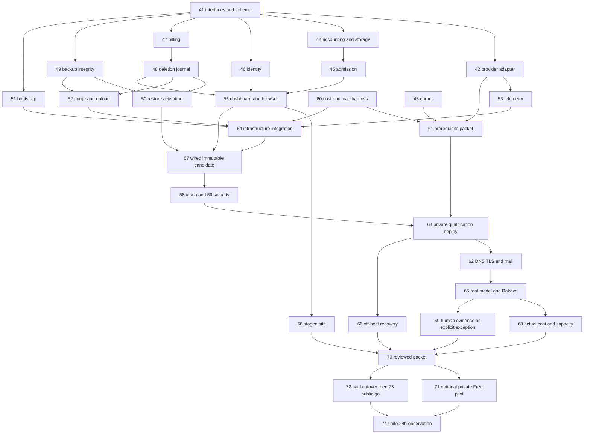

# E23 — Hosted Serenity completion and launch

**Execution plan, 2026-09-18.** Baseline: merged PR [#234](https://github.com/sirerun/serenity/pull/234), main `b9863824faaea77b0dbe059af0e0b25efdce5750`. Audience: a coordinator dispatching Claude Code **Sonnet** workers in isolated worktrees. This plan is a deliverable for review, not evidence that its remaining tasks ran.

The original implementation exists. Finish its correctness and operations gaps, qualify real services, then launch. Do not rebuild the account store, magic-link login, gateway, dashboard or billing stack. The [original September11 plan](archive/hosted-plan-2026-09-11.md) is preserved as history. Its unchecked boxes and old package/config assumptions are **not** a dispatch queue. Old task contracts T23.1–12 are superseded for remaining execution by the crosswalk below.

## Read and execute

1. This file: scope, authority, dependency graph, resource ownership and dispatch rules.
2. [Task registry](hosted-completion/tasks.json): machine-readable IDs, dependencies, write paths, gates and acceptance predicates.
3. [Worker prompt](hosted-completion/worker-prompt.md): copy into each Sonnet session with one task ID.
4. [Individual contracts](hosted-completion/index.md): T23.41–74; every worker gets exactly one contract.
5. [Interface specification](hosted-completion/interfaces.md): task41 must freeze its signatures/schema before dependent implementation.
6. [Evidence contract](hosted-completion/evidence.md), [result schema](hosted-completion/result.schema.json), and [qualification manifest](hosted-completion/qualification.example.json).

No daemon, dispatch service, scheduler or new agent framework is introduced. `scripts/hosted/check_completion_plan.py` is a finite local plan checker and preview, not an execution engine.

## What “done” means

The original goal remains a hosted service at `app.serenity.sire.run`: new person signs up by real email, gets isolated private memory, connects real Rakazo, writes/recalls after restart, sees correct limits, exports/deletes, and can use the qualified paid plans. Operators can recover from loss, revoke access, reconcile billing, see failures, and roll back. Customer data never becomes shared agent knowledge.

There are two explicitly different completion profiles:

| Profile | Deliverable | Launch authority | What stays open |
|---|---|---|---|
| `paid` (original scope; default plan profile) | Public Free/Builder/Scale service, verified live billing and complete release packet | David’s live-payment and final go/no-go actions | Only named follow-ups that do not violate launch acceptance |
| `pilot` (optional proposal) | Invitation-only Free service with the same isolation, deletion, recovery and operational safeguards | Explicit pilot selection and go/no-go | T23.63/67/72/73, paid-capacity evidence and public paid launch; trigger: pilot exit plus approved paid packet |

**Do not infer pilot approval from the recommendation.** The shared implementation includes billing/deletion reconciliation even in pilot mode, because restored historical state must never resurrect charges/access. Pilot-qualified evidence does not qualify paid capacity or billing. Switching profiles requires closing the additional dependencies, not merely flipping `billing_enabled`.

Existing rulings remain: Resend magic links; existing Sire Run Stripe account; ratified planv1 prices/allowances; AWS us-west-2 single ARM VM as current architecture; no unrelated provider key reuse; no fleet-banned Anthropic API-key billing. A different hosting topology is a costed proposal reviewed through the existing architecture path, never an individual worker choice.

## Cost and authority constraints

David reports being out of runway. The historical **$60/month ceiling is a ceiling, not a target or a new authorization to spend**. This planning task creates no resources, subscriptions, provider charges or live payment objects.

- Offline code/fixtures, worktrees, local reviews and ordinary PRs proceed under existing authorization.
- A proposed **$1 total embedding qualification allowance** is not approved merely by appearing here. Task61 prepares the dedicated OpenRouter key limit, exact workload and cost before requesting any missing authority. Prefer existing account credits; no auto-top-up, reset, paid fallback or hidden readiness/rebuild traffic.
- Provider candidate: `perplexity/pplx-embed-v1-0.6b` through `https://openrouter.ai/api/v1`. Endpoint compatibility and published benchmarks are promising, not Serenity quality/privacy qualification. Task42 verifies the actual serving provider and terms; task65 measures retrieval. Do not use Liquid/NVIDIA free hosted endpoints for private customer memories under the currently inspected data-use terms.
- Keys stay in the configured secret manager/private secret files; only names/references enter prompts and receipts. `EMBEDDINGS_API_KEY` is provider-neutral. No separate OpenAI account is required.
- Exact instance/storage/backup/IPv4/KMS/secrets/logging/email/provider cost and a bounded rehearsal-resource cleanup plan precede provisioning. Existing approved budgets/actions count; do not ask again where the record already authorizes the exact next action.
- Live Stripe, real outgoing test email, DNS apply, public activation, destructive purge/formatting and paid resource operations must match the recorded scope. Prepare concrete diffs/commands/rollback first. Founder items follow the existing chief routing; do not broadcast repeated permission questions.
- Worker agents have no new merge/deploy authority. Existing repository holds and chief-planner/chief-architect review paths apply. A previous PR merge is not authorization for every future merge.

### External gate registry

Task `external_gates` apply to its live phase; workers can prepare local code/fixtures before keys arrive.

| Gate | Owner/input | Required evidence before dependent external action |
|---|---|---|
| EMBEDDINGS | David supplies dedicated key; provider worker validates | Approved total allowance, key limit, exact model/provider pin, privacy terms, permitted synthetic inputs, call/token cap |
| MAIL | David/account owner supplies valid scoped key and controlled mailbox | Named sender/domain permission, verified records, explicit controlled test-send scope; never infer mailbox from chat |
| STRIPE_TEST | Stripe account owner supplies restricted test key | Account identity, testmode, scoped object/portal/webhook operations; generated signing secret stored privately |
| SPEND | chief routes missing concrete budget decision | Exact AWS account/region/resource change set, complete recurring/rehearsal estimate, max amount/duration, permitted new-volume format and scoped cleanup |
| DNS | foundation owner/reviewer | Reviewed foundation PR with exact A/DKIM/SPF/return-path records; appropriate existing apply authority |
| OPS | operator | Real alert destination, notification permission, accountable responder; no alarm without delivery |
| HUMANS | coordinator/David | Consenting participants or explicit unavailable-participants result; no automated test represented as human |
| PILOT_GO | David | Reviewed pilot packet and exact invitation/cap/billing-disabled activation diff |
| LIVE_BILLING | David | Paid packet, restricted live key, explicit operator payment amount/disposition, exact cutover/rollback |
| PUBLIC_GO | David | Complete paid packet, live smoke and final dated public go/no-go |

The task41 architecture review is a technical gate, not a founder product question. The coordinator resolves routine implementation decisions within these contracts. Unknown architecture/budget/retention semantics are escalated to their named owner; a Sonnet worker must not quietly weaken them.

## Verified baseline and highest-priority gaps

The merge includes identity, provisioning, scoped credentials, bounded pool/gateway, billing/metering, six-allowance dashboard, export/delete, backup/restore, service CLI, deployment templates and browser CI. On PR head `2d7902d`,15 checks passed and Pages deploy was correctly skipped. Local full race verification previously counted1,902 passing cases and6 explicit skips; this is historical evidence, not automatic acceptance of future revisions.

Read-only planning audits identified these concrete remaining risks:

1. Physical storage is checked before a write but write growth can exceed the advertised ceiling; canonical commit and separate quota finalization can disagree after a crash.
2. Deletion can miss a provider subscription whose webhook has not arrived, or leave an open checkout able to complete. Deletion must close provider state before final purge.
3. Restore freezes accounts safely but cannot finish reactivation, and an old snapshot cannot reveal later deletion without an independent trusted journal and old-writer fencing.
4. Backup manifests lack artifact checksums; missing Git state can appear empty. Current S3 current30days plus noncurrent30days can exceed the promised deletion window.
5. Global runtime/gateway locks can block unrelated tenants during cold opens; some account-lock waits are not cancellation-aware.
6. Fresh-host bootstrap, transactional deployment/rollback, delivered alarms, log-redaction proof and real-provider/client qualification remain incomplete.

Tasks44/47/48/49/50 are correctness blockers, not optional polish. Green CI on the merged candidate does not close them.

## Parallel lanes and file ownership

Use six coding tracks when capacity is already available, plus bounded qualification/release sessions. A track may execute multiple sequential contracts; a task ID is the actual claim unit. More agents do not waive machine limits.

| Track | Tasks | Primary ownership |
|---|---|---|
| Embeddings | 42,43 | Router adapter, embed tests, provider contract, synthetic corpus/harness |
| Runtime/accounting | 44 then45 | gateway.go, metering/operation ledger, pool/admission/credential capacity |
| Identity/experience | 46 then55/56,69 | Identity/provisioning, dashboard/browser, site staging and walkthrough |
| Billing | 47,63,67 | Provider reconciliation/closure, Stripe setup and lifecycle qualification |
| Durability | 49;48 after47;50 after48/49 | Backup integrity, deletion journal, safe recovery |
| Operations | 60;51;52/53;64/68 | Cost/load tools, bootstrap, upload/purge, telemetry and authorized environment |
| Integrator | 41,54,57,61,70 | Schema, service/CLI wiring, stack.json, CI/package files, aggregate docs |
| Qualification/release | 58,59,62,65,66,71–74 | Independent test/evidence files; live mutations serialized by environment lease |

**Single-writer resources:**

| Resource claim | Protected files/operations | Owner |
|---|---|---|
| R-hosted-schema | `internal/hosted/store/**`, contracts/testhooks interfaces, migration numbers and schema API | Integrator41/57 |
| R-hosted-assembly | `service.go`, existing `service_test.go`, `internal/cli/hosted.go`, config example | Integrator41/57 |
| R-hosted-runtime | `gateway.go`, admission, pool and credential packages | Runtime44/45;44 also claims R-hosted-meter |
| R-hosted-meter | `internal/hosted/meter/**` | Runtime44; billing tests live inside billing, not meter |
| R-hosted-lifecycle | `gateway/lifecycle.go`, deletion package/journal adapter | Durability48 |
| R-hosted-backup | `internal/hosted/backup/**` | Durability49 |
| R-hosted-recovery | Recovery package/new recovery CLI file | Durability50; CLI registration integrator |
| R-hosted-billing | `internal/hosted/billing/**` and Stripe test state | Billing47/63/67 |
| R-hosted-identity | Identity/provisioning packages | Experience46 |
| R-hosted-ui | Dashboard, `tests/hosted/**`, hosted Playwright config | Experience55 |
| R-hosted-site | Site content/tests/activation | Experience56, release73; never concurrent |
| R-hosted-infra | stack.json, bootstrap/deploy.py and infrastructure topology | Integrator54; bootstrap51 must finish first |
| R-hosted-backup-ops | Backup/purge scripts and timers | Operations52 |
| R-hosted-telemetry | New telemetry package/deploy telemetry | Operations53 then integrator54 |
| R-hosted-release | CI, package files, deploy.sh, Caddy/service units | Integrator57 |
| R-hosted-launch-plan | This registry/contracts and aggregate status/acceptance/runbook | Planning/integrator only |
| R-hosted-environment | SSM/config/restarts, DNS cutover, live workload, restore or Stripe mutation windows | One named live operator at a time |
| R-build-lease | Multi-package heavy builds on the mini | One foreground owner, released immediately after checks |

Additional scoped claims R-hosted-embeddings/eval/cost/crash/security/client-proof/recovery-proof/walkthrough protect their corresponding contract paths. These claims are listed per task in the registry. Live-phase environment claims serialize qualifying workloads even when their evidence files are disjoint.

Disjoint task-specific new test/harness paths remain owned by their contract; claim the task. If any paths overlap despite separate contracts, the coordinator serializes the two PRs or amends scopes first. Separate worktrees alone do not remove merge/interface collisions.

Feature workers submit exact shared-file patches/schema requirements in their own evidence directory. Integrator41/57 applies them immediately, records the resulting commit, and returns it to the worker to rebase/test. Workers never independently assign migration numbers or edit common CI/status files. A package-only pass before service wiring is PARTIAL, not feature completion.

## Dependency waves

Start **41,43,60** immediately in parallel: integration/specification, corpus and economics/load harness. After41 is accepted, **42,44,46,47,49,51** are six disjoint implementation tasks. Continue a task as soon as its dependencies pass; these waves are topological summaries, not unnecessary batch barriers.



The registry includes all edges (including paid63→64,62→67,67→66/70) omitted from the diagram for readability. It is authoritative for scheduling. There is no DNS/bootstrap cycle:64 proves private/SSM operation and outputs the EIP;62 applies DNS and proves public TLS/mail;65/67 perform public client/webhook qualification.

Artifact states avoid another cycle:

1. **Local candidate:**57 builds and stores immutable unqualified bytes with source/SHA.
2. **Restricted qualification candidate:**58/59 pass for those bytes/source;64 may deploy under the explicit budget to controlled identities.
3. **Hosted-qualified release:**70 certifies live evidence for the same bytes in its packet; no public tag is required yet.
4. **Launched:**71 or72/73 executes the approved activation and smoke. Task73 owns publishing the approved release tag/assets without rebuilding; an optional pilot71 may keep its candidate private. Artifact publication alone is not launch.

## Dispatch procedure

### Coordinator

1. Read repository AGENTS.md, shared ajent.social and Ajent inbox at start and lane boundaries. Discover live peers through the process table/cwd. Cross-check trusted holds. Never assume silence means a hold is lifted.
2. Fetch main and verify PR234 merge and any newer work. Use an isolated checkout/worktree, preserve shared dirty worktrees. Publish a sanitized ownership note to the authorized Serenity ajent.social channel.
3. Run `python3 scripts/hosted/check_completion_plan.py --profile paid --waves`. Choose a profile only from the recorded product decision; absent a change, original paid scope remains the plan.
4. Check dependency **merged source and accepted evidence**, not just a checkbox or a successful unit test. For an unavailable-human exception, require task69’s terminal receipt and the exact approved exception in70.
5. Select ready tasks with nonoverlapping writes; `--completed T23.41,T23.43,T23.60` previews a batch but does not validate completion evidence or grant authority. Check open PRs/snapshots/claims before dispatch; never duplicate an in-flight task.
6. Assign one parent-named Sonnet session per task on approved capacity, with its contract, profile, base SHA, resource claims, evidence directory and external gates. Do not send whole worker logs back; request the one-page handoff.
7. Integrate shared-file requests promptly. Independently review changes, run final relevant checks on actual final heads, and use the standing merge-gate owner. Respect trusted holds. Rebase dependent workers on merged outputs.
8. Only integrator updates aggregate status/acceptance/plan state. Incomplete work is BLOCKED/FAIL/PARTIAL with owner+next action; bank commit/PR and release only claims owned by this session. No unattended DIY dispatch loop.

### Worktrees and claims

Resolve the existing primitive; do not reimplement claim refs. A task claim and all named shared-resource claims are required before editing. Acquire multiple resources in lexical order; if any is LOST/BLOCKED, release only your already-won claims and choose another task. Only `WON:` is success (`LOST` can exit0).

```sh
# Run in a verified clean clone; choose the approved build volume for this machine.
git fetch origin main
TASK_ID=T23.43
SERENITY_WORKTREE_ROOT=/Volumes/BuildOffload/wt
git worktree add "$SERENITY_WORKTREE_ROOT/serenity-$TASK_ID" -b "hosted/$TASK_ID" origin/main
cd "$SERENITY_WORKTREE_ROOT/serenity-$TASK_ID"
CLAIM_SCRIPT="$HOME/.claude/skills/claim/scripts/claim.sh"
# Prefer the repository's .claude/scripts/claim.sh if present.
claim_output=$("$CLAIM_SCRIPT" claim "$TASK_ID" --purpose "Hosted completion $TASK_ID")
case "$claim_output" in WON:*) ;; *) echo "$claim_output"; exit 1 ;; esac
claim_sha=$(printf '%s\n' "$claim_output" | awk '{print $3}')
# Record claim_sha in private lane state. Before each write boundary, verify holder.
# At banked handoff, after coordinator records the open-PR ownership:
# "$CLAIM_SCRIPT" release "$TASK_ID" "$claim_sha"
```

Keep resource ownership through the banked handoff; coordinator must not dispatch conflicting work while the PR is open. Recheck the current ref SHA at every boundary. The primitive has no automatic renewal contract here: before local policy TTL expires, bank work and coordinate a clean release/reclaim while the open-PR hold remains; never force-push, impersonate another holder or prune a live claim. The build lease has30minTTL; split longer checks or coordinate renewal without overlapping execution.

### Heavy-build discipline

On the mini, check `uptime` and disk first. Hold if1min load>10 or internal free space<20GB. At most two build-heavy Serenity lanes; **only one multi-package heavy command holds R-build-lease at once**. More logical work tracks may read/write elsewhere on already-authorized capacity. Never run multiple `go test -race ./...` lanes. Do not provision extra worker capacity because this plan lists six tracks.

```sh
# Same foreground shell holds and releases the lease, even on failure.
build_claim=$(CLAIM_REMOTE=/Users/Shared/mini-build-lease.git "$CLAIM_SCRIPT" claim R-build-lease --purpose "$TASK_ID verification")
case "$build_claim" in WON:*) ;; *) echo "$build_claim"; exit 1 ;; esac
build_sha=$(printf '%s\n' "$build_claim" | awk '{print $3}')
trap 'CLAIM_REMOTE=/Users/Shared/mini-build-lease.git "$CLAIM_SCRIPT" release R-build-lease "$build_sha"' EXIT
export GOFLAGS=-p=2
# Run the focused commands from this task, then release promptly.
```

Use focused tests during development. Integrator runs full vet/lint/race, file-first gate and browser suite once per integrated candidate, repeating only after relevant changes/failures. Preserve genuine skips with reasons; live acceptance cases may not silently skip. Build the actual CLI from the tested SHA before browser execution and record its SHA256; no stale `/tmp` binary qualification.

## Fixed acceptance and evidence rules

- All task checklists are conjunctive. A missing live dependency produces BLOCKED/PARTIAL, not PASS. A fixture embedding vector never demonstrates semantic quality.
- Record source SHA, artifact hash, corpus/config hash, full resolved command, UTC/environment, executed counts, skips, expected/observed result, provider mode and limitations. Raw emails/tokens/facts/provider error bodies do not enter receipts. See evidence schema.
- Task43 defines **Hit@5**, not an ambiguous averaged recall score:95 one-target positive queries plus5 isolated expected-empty cases. Category floors, lexical negative controls, forbidden-ID checks and budget caps are frozen before live results. Both query and stored vectors use cosine-compatible semantics.
- Task60 freezes arrival rate/concurrency/data cardinality/duration and rejection/throughput thresholds; fast accepted requests do not hide rejected traffic. Live qualification is bounded; cached fixtures are labeled as such.
- New harness commands in contracts are required deliverables with explicit flags. A `--help` response is not evidence. Every manifest defaults external execution/spend to unapproved, and live commands refuse missing/null budgets or credentials.
- Backup validity requires checksums+inventory+journal authority; a COMPLETE object name is insufficient. Restore requires a complete journal and old-writer fencing through activation. Manual status=active SQL is forbidden.
- Forget removes current facts/search/exact-read results; history in the exported Git bundle may remain until account deletion and verified retention. Do not require history erasure from ordinary forget while promising history retention elsewhere.
- Each security/recovery family has a real local negative control; restored production guards are verified before PR. Keep fault barriers under `hostedtest` only, never a public or production-enabled backdoor.
- Changes to prices/allowances, storage meaning, retention promise or architecture require a reviewed amendment; “make the test pass” is not authority to change the contract.

## Original E23 coverage and deferrals

The [crosswalk](hosted-completion/crosswalk.md) maps every original task1–40 to current baseline evidence and remaining tasks41–74. Coverage is mechanically checked. Existing functionality does not automatically mean its original real-service acceptance is satisfied.

Every original task remains in scope unless the selected profile explicitly defers it. Pilot defers test/live paid gates and paid-capacity proof with owner Billing/Release and trigger **approved paid packet after pilot review**. Enterprise SSO, team RBAC, multi-region, general chat, connector marketplace, annual billing, model training and public knowledge sharing remain out of E23; reopening requires a new scoped plan. No unspecified “later” work is part of a launch claim.

## Estimates and progress reporting

Each contract has an active-agent-hour range. These are planning estimates, not measured completion times or a promise of a2–4day launch. Schema/design review, shared integration, the build lease, credentials, DNS/email verification, external rehearsal budgets and the final24h observation can dominate elapsed time. Parallelize the six disjoint implementation tasks after41; do not divide total hours by agent count and call that an ETA.

Coordinator reports: accepted task IDs at exact commits; currently running IDs/owners; blocked IDs with one specific missing input; next conflict-free batch; total spend so far versus approved cap; selected milestone’s remaining critical path. Keep milestone terms exact: **implemented → merged → qualified → deployed → launched**.
